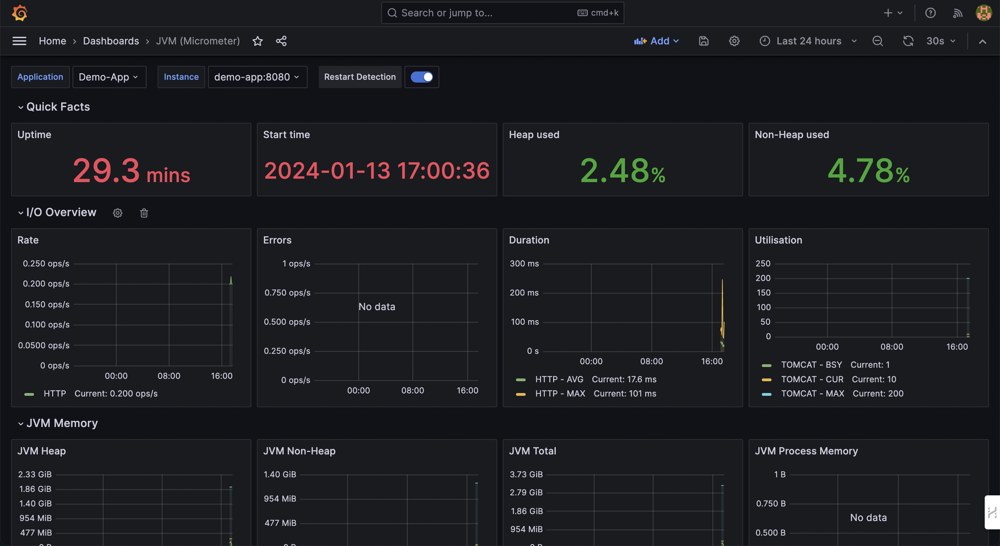

## A. Spring Boot + Prometheus + Grafana

Running Spring Boot App Monitoring suite with Prometheus and Grafana

| App  | URL  |
|---|---|
| App | [http://localhost:8080/](http://localhost:8080/) |
| Prometheus | [http://localhost:9090/graph](http://localhost:9090/graph) |
| Grafana  | [http://localhost:3000](http://localhost:3000)  |
| Spring Boot Actuator | [http://localhost:8080/actuator/metrics](http://localhost:8080/actuator/metrics)

# B. how to run?

### 방법1) 미리 provisioned된 grafana로 바로 접속하는 방법
```
1. docker compose up -d --build

2. http://localhost:3000/d/ec8379ac-7d6d-4c17-b96d-e2d74a8ca42c/jvm-micrometer?orgId=1&refresh=30s&from=now-5m&to=now
```

만약 접속이 안될 경우, 방법 2를 사용하자.

### 방법2) grafana를 수동으로 세팅하는 방법
1. docker compose up -d --build
	- 주의! grafana는 mac m1 기준으로 path configuration 되어있다. linux나 window계열은 path config를 바꿔야 한다.
	- grafana docs: https://grafana.com/docs/grafana/latest/setup-grafana/configure-grafana/
2. [http://localhost:9090/graph](http://localhost:9090/graph) -> 프로메테우스 접속
3. 프로메테우스에 status 메뉴에 targets 클릭 -> endpoint에 http://demo-app:8080/actuator/prometheus 가 떠 있는걸 확인 가능하다.
4. prometheus.graph -> expression에서 내가 원하는 metrics 클릭 -> execute 하면 결과를 볼 수 있다. 근데 Prometheus에서 보는게 ui가 별로니까, grafana로 본다.
5. http://localhost:3000/ 에서 admin/admin 치고 로그인 후,
6. add datasource -> prometheus 선택. url에 http://localhost:9090 입력 후(docker compose up으로 실행한 경우, prometheus에 container ip를 넣어줘야 한다.) save
	- docker inspect ${prometheus-container-id} 에 "IPAdress" 주소를 복붙한다.
7. dashboard -> import -> https://grafana.com/grafana/dashboards/4701-jvm-micrometer/ 를 입력한다.
	- 가장 유명한 대시보드이다
8. grafana dashboard를 확인한다.
	- last 24 hours -> last 5 min으로 바꿔서 보자
	- 
	- 만약 metric logs가 안찍힌다면, springboot app container가 잘 실행되었는지, load-test container가 실행되고 있는지 확인해보자.
	- 만약 container가 정상적으로 실행되지 않는다면, top 명령어로 cpu, memory가 100% 찍혔는지 확인하고, 만약 그렇다면 docker를 재시작 하자.
9. dashboard -> add panel -> Metric에서 원하는 지표 선택 -> Apply
10. docker-compose down


# C. 개념 설명

## a. what is spring actuator?
스프링 모니터링할 때 필요한 서버 정보 보여줌.

http://localhost:8080/actuator/ 하면, 어느 정보의 url을 보고싶은지 리스트가 나옴.\
ex. localhost:8080/actuator/env 를 하면, {"status":"UP"} 이렇게 서버가 떠있다고 나옴.


## b. spring actuator에서 제공하는 정보 리스트?
actuator에서 제공하는 정보의 default는 http://localhost:8080/actuator/metrics 이거인데,
아래의 정보를 얻을 수 있음.

```json
{"names":["jvm.classes.unloaded","tomcat.sessions.active.current","jvm.buffer.count","jvm.memory.used","tomcat.threads.busy","tomcat.sessions.alive.max","jvm.gc.live.data.size","jvm.buffer.total.capacity","jvm.memory.max","jvm.memory.committed","jvm.gc.pause","process.files.open","jvm.threads.states","tomcat.sessions.active.max","http.server.requests","jvm.buffer.memory.used","process.start.time","logback.events","tomcat.global.sent","process.files.max","jvm.gc.memory.promoted","tomcat.global.request.max","system.load.average.1m","tomcat.global.request","jvm.gc.max.data.size","system.cpu.count","tomcat.global.received","tomcat.sessions.created","jvm.threads.daemon","system.cpu.usage","jvm.gc.memory.allocated","tomcat.threads.config.max","tomcat.sessions.expired","jvm.threads.live","jvm.threads.peak","tomcat.global.error","process.uptime","tomcat.sessions.rejected","tomcat.threads.current","process.cpu.usage","jvm.classes.loaded"]}
```

build.gradle에 스프링 부트용 프로메테우스 라이브러리를 설치 & 실행하면,
http://localhost:8080/actuator/prometheus 에 프로메테우스에 제공하는 메트릭 정보를 볼 수 있다.

```
# HELP jvm_threads_live_threads The current number of live threads including both daemon and non-daemon threads
# TYPE jvm_threads_live_threads gauge
jvm_threads_live_threads{application="Demo-App",instance="Demo-Instance",} 20.0
# HELP tomcat_threads_config_max_threads
# TYPE tomcat_threads_config_max_threads gauge
tomcat_threads_config_max_threads{application="Demo-App",instance="Demo-Instance",name="http-nio-8080",} 200.0

continues..
```


## c. prometheus 쓰는 이유?
1. 단일 springboot app의 metrics 뿐만 아니라, 스케일 아웃된 여러 인스턴스의 metrics들을 하나의 prometheus 서버에 모아준다.
2. db monitoring도 해준다.
3. 뿐만 아니라 metric이 특정 임계점에 도달하면(ex. 서비스가 죽었다거나, CPU 점유율이 80% 이상 찍었다거나..) 알람 보내는 기능도 있다.


## d. grafana 쓰는 이유?
프로메테우스 UI가 있긴 한데, 보기가 불편하니까
시계열 데이터 visualization 전문 툴인 grafana 쓰는 것.


# D. how to provision grafana on local pc?

grafana를 프로메테우스와 provisioning하기 위해서는
1. datasource로 그라파나와 프로메테우스를 연결하고
2. 미리 커스텀한 .json 파일 형식의 dashboard 템플릿을 datasource와 연결지어 주어야 한다.

## a. step1 - 폴더 세팅

```
provisioning할 config file이 위치할 폴더 구조

${project-root}/
	grafana/
		conf/
			provisioning/
				datasources/
					datasource.yml
				dashboards/
					dashboards.yml
					custom-dashboard.json
		grafana_data/
```

## b. step2 - docker-compose.yml에 volume 세팅
```docker-compose.yml
  grafana:
    image: grafana/grafana-enterprise
    container_name: 'grafana'
    hostname: grafana
    restart: unless-stopped
    user: '0' # if you are running as root then set it to 0. else find the right id with the id -u command
    networks:
      - backend
    ports:
      - '3000:3000'
    volumes:
      - ./grafana/conf/provisioning/dashboards/:/usr/share/grafana/conf/provisioning/dashboards/ #주의! - os마다, grafana 버전마다 docker container에서 volume mapping해줘야하는 장소가 달라질 수 있다. 현재 config는 mac m1 기준이다.
      - ./grafana/conf/provisioning/datasources/:/usr/share/grafana/conf/provisioning/datasources/
      - ./grafana/grafana_data/:/var/lib/grafana
    environment:
      - GF_SECURITY_ADMIN_PASSWORD=admin
      - GF_USERS_ALLOW_SIGN_UP=false
    depends_on:
      - prometheus
```

프로젝트 디렉토리에 있는 dashboards/, datasources/ 와
grafana-enterprise container에 있는 그라파나 디렉토리와 연동시켜준다.
(os마다, grafana 버전마다 container location이 달라질 수 있으니, 공식 문서 참고)

## c. step3 - datasource 매핑 해주기

./grafana/conf/provisioning/datasources/datasource.yml
```
apiVersion: 1

deleteDatasources:
  - name: Prometheus
    orgId: 1

datasources:
  - name: 'Prometheus' # 이 이름을 기준으로 ./grafana/conf/provisioning/dashboards/dashboards.yml에 name 필드와 매핑된다.
    orgId: 1 # <int> Org id. Default to 1
    type: prometheus
    access: proxy
    url: http://prometheus:9090
    basicAuth: false
    isDefault: true
    version: 1
    editable: true
```


## d. step4 - dashboard와 datasource를 매핑해주기

./grafana/conf/provisioning/dashboards/dashboards.yml
```
apiVersion: 1

providers:
- name: 'Prometheus' # 이 이름이 step1에 datasource.yml에 명시한 데이터 소스의 이름이고, 이걸 기준으로 매핑한다.
  orgId: 1
  folder: ''
  type: file
  disableDeletion: false
  editable: true
  options:
    path: /var/lib/grafana/dashboards
```

## e. step5 - custom dashboards에 id = null 설정해주기

./grafana/conf/provisioning/dashboards/custom-dashboard.json

```json
...

    "description": "Dashboard for Micrometer instrumented applications (Java, Spring Boot, Micronaut)",
    "editable": true,
    "gnetId": 4701,
    "graphTooltip": 1,
    "hideControls": false,
    "id": null,
    "links": [],
    "refresh": "30s",

...
```

시중에 나와있는 그라파나 대쉬보드 템플릿을 다운받아 오면, 저 id 부분에 값이 있는데,

저 값을 null로 바꿔주지 않으면, 그라파나 대쉬보드가 datasource와 매핑하지 못하여 에러가 나므로,

"id": null로 바꿔주어야 한다.


