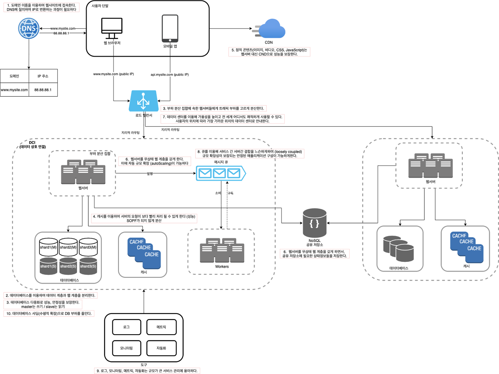

# A. 규모 확장 시스템 설계 기본

1. 단일 서버 
   DNS : 도메인 이름을 이용해 웹사이트에 접속한다. DNS에 질의하여 IP로 변환하는 과정이 필요하다. 
   http 요청을 보내고 클라이언트는 응답을 받는다

2. 데이터베이스
   데이터베이스 : 웹/모바일 트래픽 처리 서버 (웹 계층)와 데이터베이스 서버 (데이터 계층) 분리를 시도한다.

3. 로드밸런서
   로드밸런서 : 부하 분산 집합에 속한 웹서버들에게 트래픽 부하를 고르게 분산한다
   데이터베이스 : 다중화로 성능과 안정성을 보장한다 (master는 쓰기, slave는 읽기)

4. 캐시
   캐시 : 캐시를 이용해 서버의 요청이 보다 빨리 처리될 수 있게 한다. SOPF가 되지 않게 분산한다

5. 콘텐츠 전송 네트워크 (CDN)
   CND : 정적 콘텐츠(이미지, 비디오, CSS, JavaScript)는 웹 서버대신 CDN으로 성능을 보장한다

6. 무상태(stateless) 웹 계층
   웹서버 : 무상태 웹 계층을 갖게 함으로써 자동 규모 확장(autoScaling)이 가능하다
   공유 저장소 : 웹서버를 무상태 웹 계층으로 전환하면서, 필요한 상태정보들은 공유 저장소에 저장한다.

7. 데이터 센터
   로드밸런서 : 데이터 센터를 이용해 가용성을 높이고, 전 세계 어디서도 쾌적하게 사용이 가능하다. 지리적 라우팅을 이용하여 사용자의 위치에 따라 가장 가까운 위치의 데이터 센터로 안내한다.

8. 메시지 큐
   메시지 큐 : 서버간 결합을 느슨하게 하여 (loosely coupled) 규모 확장성이 보장되는 안정된 애플리케이션 구성이 가능하게 한다.
   
9. 로그, 메트릭 그리고 자동화
   도구 : 로그, 모니터링, 메트링, 자동화는 규모가 큰 서비스 관리에 용이하다

10. 데이터베이스의 규모 확장
    데이터베이스 : 샤딩으로(수평적 확장 = 서버증설) DB부하를 줄인다.

reference: book - 가상 면접 사례로 배우는 대규모 시스템 설계 기초
