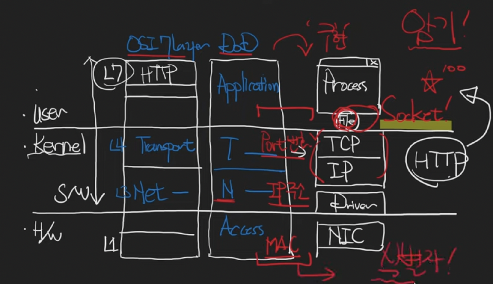

# 목차

## A. Macro
a. [규모 확장 시스템 설계 기본](#A.-규모-확장-시스템-설계-기본) \
b. [aws architecture by size](##a.-aws-architecture-by-size)
1. 사용자가 본인 1명일 때
2. 사용자가 n명일 때
3. 사용자가 100명 단위일 때
4. 사용자가 1000명 단위일 때
5. 사용자가 10000명 단위일 때
6. 사용자가 50만명 단위일 때
7. 사용자가 100만명 단위일 때
8. 사용자가 500만명 단위일 때

c. [aws architecture for startup](##b.-aws-architecture-for-startup) \
d. [3계층형 시스템](##c.-3계층형-시스템) \
e. [web server](##web-server) \
f. [WAS](##tomcat) \
g. [Spring Security](##spring-security) \
h. [Spring Security JWT](###spring-security-jwt) \
i. [Spring MVC](##spring-mvc) \
j. [JDBC](##jdbc) \
k. [Database](##database)

## B. Micro
a. [폰 노이만 구조](##von-neumann-architecture) \
b. [OSI on OS](##osi-on-os) \
c. [Compiler](##compiler) \
d. [JVM](##jvm)

# A. 규모 확장 시스템 설계 기본

## a. AWS architecture by size

### 1. 사용자가 본인 1명일 때

고정 public IP가 필요해서 Elastic IP 씀.
route53을 통해 해당 IP를 DNS 등록.

### 2. 사용자가 n명일 때

db 인스턴스 분리 on ec2 

### 3. 사용자가 100명 단위일 때

db on ec2에 백업과 같은 작업, 업데이 부담 덜기 위해 RDS 사용.
코어 개발에만 집중

### 4. 사용자가 1000명 단위일 때

이중화 함
앞에 load balancer 붙여줌
RDB의 Multi-AZ옵션 사용해서 Master-Standby db로 나눠 backup 관리 

### 5. 사용자가 10000명 단위일 때

backend-app의 인스턴스 수 늘림.
Master db에 부하가 심해지니까, read-only replica db 만들어 부하 분산

static file들 s3 && clount front로 이전, WAS에 부하 분산

session 정보, app의 임시정보를 모두 ec2 instance에서 관리하지 말고,
Elastic cache의 Redis나 DynamoDB로 관리

동적 컨텐츠도 CloudFront이용해서 CDN으로 처리해서 ec2 WAS 부하 분산 

### 6. 사용자가 50만명 단위일 때

CloudWatch로 auto scaling(up+out)
모든 작업들에 대해 자동화, 모니터링, 로그분석, 이슈에 대한 대응방안 필요

### 7. 사용자가 100만명 단위일 때

앞에 언급된 모든 요소 점검
1. Multi-AZ
2. 계층간 로드 밸런싱
3. 오토 스케일링
4. 느슨한 결합과 서비스 재활용
5. 효율적인 컨텐츠 제공
6. DB 캐싱과 읽기작업 부하 오프 로를 위한 읽기 전용 복제본 설정
7. 오토 스케일하는 계층의 세션 상태 이전

### 8. 사용자가 500만명 단위일 때
이정도 유저 사이즈면 아무리 경량화 해도 db write에 병목 발생함.

1. Federation

데이터 베이스를 기능 및 목적에 따라 분리. 
db간 교차-함수 쿼리가 어려움
 

2. Sharding

db를 용도에 맞게 분리화 하더라도, db 테이블 자체가 너무 크거나,
교차-함수 쿼리가 어려우면, 수평적 확장인 샤딩 고려.

3. 특정 기능을 다른 종류의 DB로 변경

NoSQL 도입 검토

관리형 NoSQL 서비스인 DynamoDB 이용

관계형으로 정의할 수 있는 데이터가 아닌, 정제되지 않은 데이터를 저장해야 한다면 적합

ex)
리더보드/득점표
클릭스트림 및 로그 데이터의 빠른 인 업
임시 데이터(장바구니)
핫 테이블
메타 데이터 / 검색 테이블

## b. aws architecture for startup

### 1. 요약
1. 데이터 흐름
2. VPC 생성
3. Subnet 생성
4. Internet Gateway, NAT Gateway 생성
5. Routing Table, Network ACL 설정
6. AWS Lambda를 Private Subnet에서 구성

### 2. 데이터 흐름
a. User
1. CloudFront를 통해 S3에서 호스팅 되는 React App 접속 
2. Route53을 통해 Internet Gateway로 이동
3. ALB를 통해 Public Subnet 라우팅 테이블로 이동
4. 라우팅 테이블에서 ALB 를 통해 접근한 트래픽은 어플리케이션으로 트래픽을 보냄
5. 정상적이지 않은 접근일 경우 다시 Internet Gateway로 포워딩
6. EB 어플리케이션은 내부 IP를 사용하여 MySQL에 접근

b. DevOps
1. EC2 접근 최소화
2. 굳이 접근 해야 한다면, Bastion 서버를 중간에 두고 접근
3. 로그 등은 반드시 언제든 확인할 수 있는 시스템을 갖추어야 한다.
3. 데이터 베이스 접근 역시 Bastion 서버를 중간에 두고 접근
4. 굳이 Bastion 서버가 아니더라도 VPN 등을 두고 접근을 실시한다.

c. Lambda
1. Lambda가 Private Subnet 에서 생성됨 
2. 인터넷을 사용해야 할 경우 Public Subnet 에 있는 NAT Gateway를 통해 인터넷에 접근함
3. 데이터베이스 사용시 내부IP를 이용하여 데이터베이스에 접근

## c. 3계층형 시스템

## Web Server

## Tomcat

## Spring Security

### Spring Security JWT

## Spring MVC

## JDBC

## Database

# Low Level

## Von Neumann Architecture

## OSI on OS

## Compiler

## JVM

