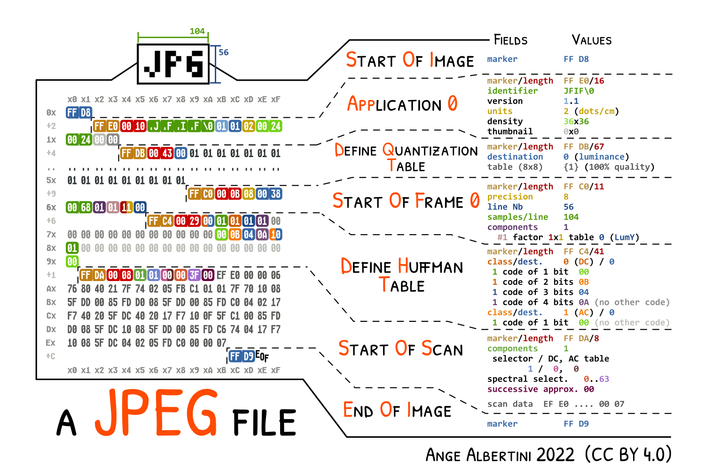
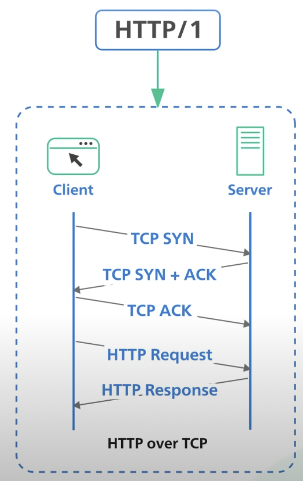

# 목차


a. [Computer Architecture](#computer-architecture)\
&nbsp;&nbsp;&nbsp;&nbsp;1. [컴퓨터 구조](#computer-architecture-all) \
&nbsp;&nbsp;&nbsp;&nbsp;2. [폰 노이만 구조](#von-neumann-architecture) \
&nbsp;&nbsp;&nbsp;&nbsp;3. [CPU](#cpu) \
&nbsp;&nbsp;&nbsp;&nbsp;4. [Cache](#cache) \
&nbsp;&nbsp;&nbsp;&nbsp;5. [Bus](#bus) \
&nbsp;&nbsp;&nbsp;&nbsp;6. [IO](#io) \
&nbsp;&nbsp;&nbsp;&nbsp;x. [Application](#application) \
&nbsp;&nbsp;&nbsp;&nbsp;x. [Charsets and Encodings](#charsets-and-encodings) \
&nbsp;&nbsp;&nbsp;&nbsp;x. [Color and Image](#color-and-image) \
&nbsp;&nbsp;&nbsp;&nbsp;x. [File Format](#file-format) \
&nbsp;&nbsp;&nbsp;&nbsp;x. [Archive](#archive) \
&nbsp;&nbsp;&nbsp;&nbsp;x. [Audio](#audio) \
b. [Operating System](#operating-system) \
&nbsp;&nbsp;&nbsp;&nbsp;1. [System Call](#kernel\)-1-system-call) \
&nbsp;&nbsp;&nbsp;&nbsp;2. [Process 관리](#kernel\)-2-process-관리) \
&nbsp;&nbsp;&nbsp;&nbsp;3. [메모리 관리](#kernel\)-3-메모리-관리) \
&nbsp;&nbsp;&nbsp;&nbsp;4. [가상화](#가상화) \
c. [Network](#network) \
&nbsp;&nbsp;&nbsp;&nbsp;1. [브라우저에 google.com 치면 일어나는 일](#브라우저에-google.com-치면-일어나는-일) \
&nbsp;&nbsp;&nbsp;&nbsp;2. [Http](#http) \
&nbsp;&nbsp;&nbsp;&nbsp;3. [Url](#url) \
&nbsp;&nbsp;&nbsp;&nbsp;4. [DNS](#dns) \
&nbsp;&nbsp;&nbsp;&nbsp;5. [Packet](#packet) \
&nbsp;&nbsp;&nbsp;&nbsp;6. [OSI Layers on Operating System](#osi-layers-on-os) \
&nbsp;&nbsp;&nbsp;&nbsp;7. [1. Physical Layer](#1-physical-layer) \
&nbsp;&nbsp;&nbsp;&nbsp;8. [2. Datalink Layer](#2-datalink-layer-on-l2-switch(frame)) \
&nbsp;&nbsp;&nbsp;&nbsp;9. [ARP Protocol](#arp-protocol) \
&nbsp;&nbsp;&nbsp;&nbsp;10. [NAT](#nat) \
&nbsp;&nbsp;&nbsp;&nbsp;11. [DMZ](#dmz) \
&nbsp;&nbsp;&nbsp;&nbsp;12. [Firewall](#firewall) \
&nbsp;&nbsp;&nbsp;&nbsp;13. [3. Network Layer](#network-layer-on-l3-switch(packet)) \
&nbsp;&nbsp;&nbsp;&nbsp;14. [3 Way Handshake](#3-way-handshake) \
&nbsp;&nbsp;&nbsp;&nbsp;15. [SSL](#ssl) \
&nbsp;&nbsp;&nbsp;&nbsp;16. [4 Way Handshake](#4-way-handshake) \
d. [규모 확장 시스템 설계 기본](#규모-확장-시스템-설계-기본) \
e. [aws architecture by size](#aws-architecture-by-size) \
&nbsp;&nbsp;&nbsp;&nbsp;1. [사용자가 본인 1명일 때](#1-사용자가-본인-1명일-때) \
&nbsp;&nbsp;&nbsp;&nbsp;2. [사용자가 n명일 때](#2-사용자가-n명일-때) \
&nbsp;&nbsp;&nbsp;&nbsp;3. [사용자가 100명 단위일 때](#3-사용자가-100명-단위일-때) \
&nbsp;&nbsp;&nbsp;&nbsp;4. [사용자가 1000명 단위일 때](#4-사용자가-1000명-단위일-때) \
&nbsp;&nbsp;&nbsp;&nbsp;5. [사용자가 10000명 단위일 때](#5-사용자가-10000명-단위일-때) \
&nbsp;&nbsp;&nbsp;&nbsp;6. [사용자가 50만명 단위일 때](#6-사용자가-50만명-단위일-때) \
&nbsp;&nbsp;&nbsp;&nbsp;7. [사용자가 100만명 단위일 때](#7-사용자가-100만명-단위일-때) \
&nbsp;&nbsp;&nbsp;&nbsp;8. [사용자가 500만명 단위일 때](#8-사용자가-500만명-단위일-때) \
f. [aws architecture for startup](#aws-architecture-for-startup) \
g. [3계층형 시스템](#3계층형-시스템) \
h. [Web Server](#web-server) \
i. [CGI](#cgi) \
j. [Web Application Server](#web-application-server) \
k. [Servlet](#servlet) \
l. [JVM](#jvm) \
m. [Garbage Collector](#garbage-collector) \
n. [Spring Security](#spring-security) \
&nbsp;&nbsp;&nbsp;&nbsp;1. [암호화](#암호화) \
&nbsp;&nbsp;&nbsp;&nbsp;2. [대칭 키](#대칭-키) \
&nbsp;&nbsp;&nbsp;&nbsp;3. [비대칭 키](#비대칭-키) \
&nbsp;&nbsp;&nbsp;&nbsp;4. [대칭키 + 비대칭 키](#대칭-키-+-비대칭-키) \
&nbsp;&nbsp;&nbsp;&nbsp;5. [session](#session) \
&nbsp;&nbsp;&nbsp;&nbsp;6. [JWT](#jwt) \
&nbsp;&nbsp;&nbsp;&nbsp;7. [Refresh token](#refresh-token) \
&nbsp;&nbsp;&nbsp;&nbsp;8. [Web Context](#web-context) \
&nbsp;&nbsp;&nbsp;&nbsp;9. [Spring Security basic architecture](#spring-security-basic) \
&nbsp;&nbsp;&nbsp;&nbsp;10. [Spring Security JWT](#spring-security-jwt) \
&nbsp;&nbsp;&nbsp;&nbsp;11. [CORS](#cors) \
&nbsp;&nbsp;&nbsp;&nbsp;12. [XSS](#xss) \
&nbsp;&nbsp;&nbsp;&nbsp;13. [XSRF](#xsrf) \
o. [AOP](#aop) \
p. [Spring MVC](#spring-mvc) \
q. [JDBC](#jdbc) \
r. [Database](#database) \
&nbsp;&nbsp;&nbsp;&nbsp;1. [Mysql Architecture](#mysql-architecture) \
&nbsp;&nbsp;&nbsp;&nbsp;2. [B Tree](#b-tree) \
s. [UIUX](#uiux) \
t. [Critical Rendering Path](#critical-rendering-path) \
&nbsp;&nbsp;&nbsp;&nbsp;1. [Critical Rendering Path 기본 구조](#critical-rendering-path-기본-구조) \
&nbsp;&nbsp;&nbsp;&nbsp;2. [Critical Rendering Path async 최적화](#critical-rendering-path-async-최적화) \
u. [Version Control](#version-control) \
&nbsp;&nbsp;&nbsp;&nbsp;1. [Git Overall](#git-overall) \
&nbsp;&nbsp;&nbsp;&nbsp;2. [Git Branch](#git-branch) \
&nbsp;&nbsp;&nbsp;&nbsp;3. [Git Workflow](#git-workflow) \
v. [Compiler](#compiler) \
&nbsp;&nbsp;&nbsp;&nbsp;1. [Compiler](#근본-compiler) \
&nbsp;&nbsp;&nbsp;&nbsp;2. [JIT Compiler](#jit-compiler) \
&nbsp;&nbsp;&nbsp;&nbsp;3. [Interpreter](#interpreter) \
w. [Build](#build) \
x. [CI](#github-action-ci) \
end. [reference](#reference)
---
more
database: transaction, lock, isolation level, index, JPA N+1

# Computer Architecture

### Computer Architecture All


### Von Neumann Architecture


### CPU


a. CPU

연산은 1초에 1억회 이상 실시 (core)

### CACHE


1. L1 Cache: 프로세서와 가장 가까운 캐시. 속도를 위해 I$와 D$로 나뉜다.
   1. Instruction Cache (I$): 메모리의 TEXT 영역 데이터를 다루는 캐시.
   2. Data Cache (D$): TEXT 영역을 제외한 모든 데이터를 다루는 캐시.
2. L2 Cache: 용량이 큰 캐시. 크기를 위해 L1 캐시처럼 나누지 않는다.
3. L3 Cache: 멀티 코어 시스템에서 여러 코어가 공유하는 캐시.


---
공간지역성, 시간 지역성


운영체제는 프로세스를 페이지(Page)라는 단위로 나눠 관리하며, 위 그림은 페이지를 참조한 기록.\
arr[]는 공간지역성이 높고,\
지속적으로 같은 객체 참조하는건 시간지역성이 높음.

이걸 바탕으로 다음 필요한 데이터를 예측해서 가져오는데,
예측이 맞으면 cache hit, 틀리면 cache miss -> 그 다음 메모리에서 가져옴


---
응답속도 보고 에러난 컴포넌트 예측하기


백엔드는 하드웨어 에런지 클라우드 에런지, 디비 에런지 모르잖아?\
큰 범위부터 좁혀가야 하는데, 방법 중 하나가 ms

ex)\
Q. 만약 사용중인 static 페이지가 400ms 속도로 느리게 로딩한다면?\
A. 이미지, js파일 같은 정적 파일이 캐시가 아닌 디스크에서 온다는걸로 판단 가능.

### BUS


CPU, 메모리, 그외 IO장치들의 데이터 옮겨줌.
1. address bus
2. data bus
3. control bus

OS의 Interrupt에 의해중간 침범 당할 떄도 있음.


PCI (Peripheral Component Interconnect Bus)

모든 종류의 버스가 이어지는 대로

PCI 3.0 은 1회선당 2GB/s의 전송이 가능\
x8은 8선(8배), x16은 16선(16배)을 의미

---
CPU에 가까울 수록 버스 대역이 큼.
1. 메모리
   1. HDD는 4Gb/s, 8GB/s
   2. DDR3 RAM은 10.6GB/s
2. FILE
   1. USB는 12MB/s으로 받고 60MB/s으로 보냄
   2. CD/DVD는 120MB/s으로 받고 150MB/s으로 보냄
   3. Flash card는 10~40MB으로 받고 60MB/s으로 보냄
3. SOCKET
   1. NIC는 128MB/s으로 받는데 1GB/s로 보냄

CPU랑 IO controller랑 동신 속도는 12.8GB/s. 더 빠름.


### IO


NIC랑 연결되는 IO랑\
USB 포트랑 연결되는 IO랑\
HDD or RAM에 연결되는 IO가 다 다르고,\
버스가 CPU로 실어나르고,\
CPU와 직접 데이터 교환하는게 아니라 캐시를 통해 교환함.


### Application

Program = Input -> Computation -> Output


A. Input
1. contents
   1. gamification
2. user info


B. Computation

1. create
   1. automation (RPA -> AI)
      1. calc == new Node()
         1. prediction
            1. statistics -> Big Data + ML
         2. image
            1. photoshop -> video editing -> stable diffusion
      2. relate (recommendation) == link(Node1, Node2)
         1. human: facebook, linkedin
         2. stuff: e-commerce
         3. idea: mindmap, articles
      3. organize(sort & search & visualize) == sort(Nodes)
         1. linear
            1. docs
            2. management
         2. non-linear
            1. google
            2. hitomi (post-modernistic)

2. store
   1. time - memory
      1. 현재 정보 -> 미래로 전달(ex. memo, library, wiki, vcs)
   2. space - cloud
      1. 정보를 다른 곳에서 쓸 수 있게 처리(ex. cloud, backup)

3. transfer
   1. human to human (whom to trust? authority issue)
      1. 1 to 1
         1. messenger
      2. 1 to N
         1. subscription model
      3. N to N
         1. community(cafe, sns, blog, youtube)
   2. dimention
      1. 1d(text)
      2. 2d(image)
      3. 3d(video)
      4. 3.5d(AR)
      5. 4d(game, VR)

4. destroy
   1. compression


C. Output

1. format (UIUX)
   1. string
   2. image
   3. video
   4. AR
   5. game -> VR

---
Q
1. new way of input?
2. how to compress information?
   1. how to loss-less compression?
3. most effective way to visualize to max UX?
4. how to make system sustainable?
   1. change methods other than fee, subscription, ads, patronize?

### Charsets and Encodings


### Color and Image





### File Format


### Archive


### Audio


# Operating System


### 1. kernel 1) System Call


### 2. kernel 2) Process 관리


### 3. kernel 3) 메모리 관리


---
가상 메모리


---
저장방법: 고정길이 vs 가변길이


고정길이는 크기, 위치가 정해져 있어 쉽게 access 가능 -> 빠른 read(성능 good)\
대신 안쓰는 공간 생김(공간 bad).

가변길이는 공간 유용하게 쓸 수 있지만,(공간 good)\
칸막이 위치가 안정해져있어서 원하는 책 찾으려면 고정 길이에 비해 시간걸림.(성능 bad)

### 4. 가상화
한개에 물리 서버 안에 여러 논리서버 만들어 scale out 가능.


1. 안정성 - 물리서버 이중화 해서 한쪽 망가지더라도 구동 가능.
2. scale out 용이

---
Hypervisor -> Container


docker-compose 짱짱맨
1. 이제 os 까는데 몇시간 쓰고
2. os별로 환경세팅하는데 시간 엄청 안써도 됨


# Network

### 브라우저에 google.com 치면 일어나는 일


### http

http request

ex.
http://www.google.com/advisor/selectBeerTaste.do


http response


---
evolution of HTTP


---
1. Http 1.0



1. 매번 tcp 3 way handshakes -> 네트워크 부하
2. 이를 해결하려고 cookie & session과 tcp connection 재활용하는 http 1.1 나옴.


---
2. Http 1.1


1. 3 way handshake 이후 TCP connection 재사용
2. pipelining이라고 multiple request 비동기로 보내고, 순서대로 받으면 인정해주는 시스템 시도했으나 실패
3. line blocking이라고 pipelining시 첫째 안오면 기다리게 했는데, packet loss하면 하염없이 기다림 -> 성능하락

---
3. Http 2.0


1. IO multiplexing: 비동기로 여러개 보내고 서순 고려 안하고 받아 마지막에 재조립
2. 얘도 line blocking issue 존재
3. server push -> client poll 기능
4. http request header 을 Huffman Coding 방식으로 압축함. 두번째 request부터는 diff 한 부분만 보냄.


---
4. Http 3.0


1. TCP -> UDP 전환\
2. 대신 보안으로 TLS 필수


### url


### DNS

DNS 얻는 과정

1. 자기 PC 메모리 뒤져서 DNS cache 메모리에 google.com에 매핑되는 공인 IP address를 찾음
2. 없으면, 자기 PC에 host 파일 뒤짐.
3. 그래도 없으면, DNS server한테 물어봄.
    1. 대부분 공유기 쓰는데, 공유기는 DNS forwarding 기능 제공함. 그래서 공유기가 응답 해줌
4. 그래도 없으면, ISP(kt,lg,sk)의 root DNS server한테 물음. 응답 오면 DNS cache에 저장해둠. 나중에 또 안물으려고.
5. 그래도 없으면 ICANN에게 물어보고 응답오면 DNS cache에 저장해 둠.


### Packet

최대 사이즈 1500byte(1.5kb)


Q. 만약 1.5MB 사이즈의 파일을 보낸다면?
1. HDD, SSD에서 1.5MB중 64kb 단위로 쪼개서 읽음
2. RAM buffer에 저 쪼갠 64kb 조각들 중 몇개를 올림
3. Application Layer에서 http protocol에 따라 http request 작성
4. Process가 File이든 Socket이든(본질적으로 동일) 입출력 시도하면,
5. RAM buffer에 저장된 64kb 사이즈의 stream형식의 길다란 데이터를 TCP 버퍼에 옮겨 담은 후,
6. Transport Layer에서 encapsulation으로 일정 단위(1460byte)로 끊어서 Segment화 한 후에 번호 붙임(비동기로 쏠건데, 그래야 나중에 서순 재정렬 할 수 있으니까)
7. Network Layer에서 Encapsulation 해서 packet으로 만든다. (1460byte payload data + tcp header 20byte + ip header 20byte == 1500byte)
8. 이걸 또 Datalink Layer에서 encapsulate해서 frame으로 만든다.
9. frame은 DataLink Layer에 LAN card(NIC)을 거쳐서 Router을 거쳐서 인터넷으로 나간다.


data를 보낼 땐,\
7th. Application Layer\
4th. Transport Layer\
3th. Network Layer\
2nd. Datalink Layer\
단계별로 payload + 헤더로 감싸서 보냄.


packet을 받을 땐, 반대로
2nd. Datalink Layer\
3th. Network Layer\
4th. Transport Layer\
7th. Application Layer

헤더 까면서 위층으로 payload보내며 올라감.\
File이건 Socket이건 Stream에 비동기로 오는애들 순서 상관없이 쌓아놓고,
맨 마지막에 한번에 순서 정렬함.


### OSI Layers on OS


Application Layer에서 app Process가 File이건 Socket이건 소켓을 열어서\
Transport Layer인 TCP에서 Segment를 만들고\
Network Layer인 IP에서 Packet을 만들고\
Datalink Layer인 Device Driver에서 Frame을 만들어서\
Physical Layer인 NIC를 통해 전송


### 1. Physical Layer


voltage가 위로 튀면1, 아래로 튀면 0


어디가 처음인지 어떻게 앎? (ethernet protocol 기준)

1. 맨 처음 0 voltage
2. 처음 데이터 보내기전 56bit의 distinctive pattern의 'preamble'보냄. 101010101010...


3. 11이 갑툭튀함 -> 데이터 보내기 시작한다는 신호


물리층에서 가장 많이 고민하는 사항
1. bandwidth(대역폭) : 몇차선 도로?
2. latency : n차선 도로에서 차가 막히는 정도라고 보면 됨.


### 2. Datalink Layer on L2 Switch(Frame)

1. preamble: physical layer에서 56개의 10101010...
2. B는 destination의 mac 주소. 이 경우, router의 mac 주소.
3. A는 보내는 기기의 mac 주소.


L2 switch\
pass mac address through (hub || bridge || 공유기)\
종류1. hub = 들어온 input 무지성으로 연결된 놈들에게 다 쏨\
종류2. bridge = 들어온 input 무지성으로 다 쏘는게 아니라 Frame(Ethernet protocol) 까봐서 도착지 정해서 보냄.\
종류3. 공유기 = bridge + NAT


### ARP Protocol

LAN안에 내 pc가, 공유기의 MAC Address 몰라서, ARP 날림.

ARP protocol: IP address로 mac address찾는 방법\
라우터의 mac address 찾기


목적지 맥주소 몰라서 FF FF FF FF FF FF로 작성함\
1로 꽉 채운 것. 그럼 LAN안 모두한테 보냄.


중간에 00 00 00 00 00 00이 맥주소 비워둔 것. 도착지 MAC주소 모르니까.\
c0 a8 00 1e도 도착지 ip(라우터 공인ip)를 16진수화 한 것\
ip주소가 안맞으면 요청 무시, 맞으면 본인의 MAC주소 적어 답장


ARP table


### NAT


1. ip 주소 절약
2. 내부 주소 숨김

### DMZ


내부 네트워크에 존재하지만, 외부에서 접근할 수 있는 특수한 네트워크 영역\
내부 네트워크에 바로 접속 못하게 보안목적

### Firewall


1. 패킷 필터형
   1. 통과하는 패킷을 포트 번호나 IP 주소를 바탕으로 필터링한다.
2. 애플리케이션 게이트웨이형
   1. 일종의 프록시 서버
   2. 세션에 포함된 정보 검사하기 위해 기존 세션 종료하고 새로운 세션 만듬
   3. 패킷 필터형에 비해 속도는 느리지만 더 많은 검사 수행 가능 (spoofing 같은..)

### Network Layer on L3 Switch(Packet)


L3 switch
1. router는 한 층에 여러 L2 switch의 요청을 NAT안에서 관리
2. pass IP address

Internet Protocol(IP) Flow


### 3 Way Handshake


정확한 전송 보장 위해 상대방 컴퓨터와 사전에 세션 수립


### SSL
http's' is on ssl


서버랑 client만 똑 띄어서 보면,

비대칭키로 대칭키 옮긴 후, 대칭키로 암호화, 복호화

tls handshake


### 4 Way Handshake


TCP 연결했던 세션 종료

# 규모 확장 시스템 설계 기본


# AWS architecture by size

### 1. 사용자가 본인 1명일 때


고정 public IP가 필요해서 Elastic IP 씀.
route53을 통해 해당 IP를 DNS 등록.

### 2. 사용자가 n명일 때


db 인스턴스 분리 on ec2

### 3. 사용자가 100명 단위일 때


db on ec2에 백업과 같은 작업, 업데이 부담 덜기 위해 RDS 사용.
코어 개발에만 집중

### 4. 사용자가 1000명 단위일 때


이중화 함
앞에 load balancer 붙여줌
RDB의 Multi-AZ옵션 사용해서 Master-Standby db로 나눠 backup 관리

### 5. 사용자가 10000명 단위일 때


backend-app의 인스턴스 수 늘림.
Master db에 부하가 심해지니까, read-only replica db 만들어 부하 분산


static file들 s3 && clount front로 이전, WAS에 부하 분산


session 정보, app의 임시정보를 모두 ec2 instance에서 관리하지 말고,
Elastic cache의 Redis나 DynamoDB로 관리


동적 컨텐츠도 CloudFront이용해서 CDN으로 처리해서 ec2 WAS 부하 분산


### 6. 사용자가 50만명 단위일 때


CloudWatch로 auto scaling(up+out)
모든 작업들에 대해 자동화, 모니터링, 로그분석, 이슈에 대한 대응방안 필요

### 7. 사용자가 100만명 단위일 때


앞에 언급된 모든 요소 점검
1. Multi-AZ
2. 계층간 로드 밸런싱
3. 오토 스케일링
4. 느슨한 결합과 서비스 재활용
5. 효율적인 컨텐츠 제공
6. DB 캐싱과 읽기작업 부하 오프 로를 위한 읽기 전용 복제본 설정
7. 오토 스케일하는 계층의 세션 상태 이전

### 8. 사용자가 500만명 단위일 때
이정도 유저 사이즈면 아무리 경량화 해도 db write에 병목 발생함.

1. Federation


데이터 베이스를 기능 및 목적에 따라 분리.
db간 교차-함수 쿼리가 어려움


2. Sharding

db를 용도에 맞게 분리화 하더라도, db 테이블 자체가 너무 크거나,
교차-함수 쿼리가 어려우면, 수평적 확장인 샤딩 고려.


3. 특정 기능을 다른 종류의 DB로 변경

NoSQL 도입 검토

관리형 NoSQL 서비스인 DynamoDB 이용

관계형으로 정의할 수 있는 데이터가 아닌, 정제되지 않은 데이터를 저장해야 한다면 적합

ex)
리더보드/득점표
클릭스트림 및 로그 데이터의 빠른 인 업
임시 데이터(장바구니)
핫 테이블
메타 데이터 / 검색 테이블


# aws architecture for startup


### 1. 요약
1. 데이터 흐름
2. VPC 생성
3. Subnet 생성
4. Internet Gateway, NAT Gateway 생성
5. Routing Table, Network ACL 설정
6. AWS Lambda를 Private Subnet에서 구성


### 2. 데이터 흐름
a. User
1. CloudFront를 통해 S3에서 호스팅 되는 React App 접속
2. Route53을 통해 Internet Gateway로 이동
3. ALB를 통해 Public Subnet 라우팅 테이블로 이동
4. 라우팅 테이블에서 ALB 를 통해 접근한 트래픽은 어플리케이션으로 트래픽을 보냄
5. 정상적이지 않은 접근일 경우 다시 Internet Gateway로 포워딩
6. EB 어플리케이션은 내부 IP를 사용하여 MySQL에 접근


b. DevOps
1. EC2 접근 최소화
2. 굳이 접근 해야 한다면, Bastion 서버를 중간에 두고 접근
3. 로그 등은 반드시 언제든 확인할 수 있는 시스템을 갖추어야 한다.
3. 데이터 베이스 접근 역시 Bastion 서버를 중간에 두고 접근
4. 굳이 Bastion 서버가 아니더라도 VPN 등을 두고 접근을 실시한다.


c. Lambda
1. Lambda가 Private Subnet 에서 생성됨
2. 인터넷을 사용해야 할 경우 Public Subnet 에 있는 NAT Gateway를 통해 인터넷에 접근함
3. 데이터베이스 사용시 내부IP를 이용하여 데이터베이스에 접근


# 3계층형 시스템


MVC


# Web Server


# CGI

CGI
1. 정적 데이터만 처리할 땐, client -> web server만 있었는데,
2. database로 동적 데이터 처리해야 하니까,
   1. client -> web server -> Application -> database
   2. web server: httpd, nginx
   3. Application: php, java, python, etc
3. 이 때, 웹 서버(apache, nginx, etc)의 http protocol랑 AP server(php, java, python)의 언어 사이 통신규약이 필요해서 나온게 Common Gateway Interface(CGI)

---
A. 인터프리터 방식


1. 스크립트 엔진이
2. 스크립트(.php, .pl, .asp, .py) 실행
3. 파싱
4. 결과를 web server에 던져줌


---
B. 자바는? .class는 어떻게 실행? 자바는 인터프리터 언어가 아닌데?


1. jvm이 .class 파일 실행하지?
2. jvm 돌게 하기 위해 자바 프로그램 관리 서버가 필요.
3. 자바 프로그램 관리 서버는 CGI 프로그램


자바 프로그램 관리 서버인데 CGI 규칙을 따르는 프로그램 = Servlet Container\
Servlet Container는 Web Application Server라고 표현하며, 종류로는 Tomcat, Jetty 등등 이 있음.


서브릿 컨테이너가 servlet객체의 life cycle 관리하면서
서블릿 컨테이너가 자바 프로그램을 Servlet이라는 인터페이스로 호출

.class 실행은 JVM이 함


# Web Application Server
Servlet Container

Servlet Lifecycle 관리 + Thread pool 관리

ex. Tomcat


Servlet을 관리하는 엔진: Catalina


---
Thread Pool
1. 실행중인 프로그램을 프로세스라 부르고, 그 프로세스의 실행단위가 스레드이다.
2. 컴퓨터 CPU core는 Thread 단위로 작업을 처리한다. (1 core = 1 thread)
3. core에서 작업하던 thread의 stack정보를 로드함 -> context switching cost -> CPU overhead
4. if 요청수에 비해 너무 많게 설정 -> 놀고 있는 스레드가 많아져 메모리,cpu 자원 비효율 증대
5. if 너무 적게 설정 -> 동시 처리 요청수가 줄어든다. 평균응답시간, TPS 감소
6. thread 생성시 비용이 많이 들기에, thread pool안에 미리 생성해 놓고 사용.
   1. tomcat9.0 기준, min(idle) 25개, max 200개 로 default가 되어있더라.
   2. Q. 근데 쓰레드 갯수 200개면 넘 많은거 아님? 1core = 1thread 하래매?
      1. Tomcat 8.5부터는 NIO라고 non-blocking io 씀.
   3. Q. 근데 쓰레드 100개가 컨트롤러 하나에 요청하면 감당 가능함?
      1. db에서 write해서 멀티 쓰레드 환경에서 동기화 처리 필요하지 controller는 상태보관 안하고 일종의 read만 하니까 괜찮.
      2. 결론: @Bean 붙은 객체들은 멀티 쓰레드 환경에서 상태보관(write)하게 시키지 말자. 앵간하면.

```yml
# application.yml (적어놓은 값은 default)
server:
  tomcat:
    threads:
      max: 200 # 생성할 수 있는 thread의 총 개수
      min-spare: 10 # 항상 활성화 되어있는(idle) thread의 개수
    max-connections: 8192 # 수립가능한 connection의 총 개수. http request가 byte[]로 오면, Socket Connection으로 받아 HttpServletRequest로 파싱 후 Stream으로 전달하는데, 이 때, 받는 Connection의 최대 갯수.
    accept-count: 100 # 작업큐의 사이즈. 스프링 부트에선 아무 옵션을 안주면 Integer.MAX, 즉 21억 블라블라를 줬습니다. 이는 무한 대기열 전략 으로, 아무리 요청이 많이 들어와도 core size를 늘리지 않는다는 정책입니다. 무한 대기열 전략에선 작업큐가 꽉 찰 일이 없으므로, 스레드풀의 max사이즈가 의미가 없습니다.
    connection-timeout: 20000 # timeout 판단 기준 시간, 20초
  port: 8080 # 서버를 띄울 포트번호
```


Thread Pool 동작과정
1. 첫 작업이 들어오면, CPU Core 갯수만큼 스레드를 생성합니다.
2. 유저 요청(Connection, Server socket에서 accept한 소캣 객체)이 들어올 때마다 작업 큐(queue)에 담아둡니다.
3. core size의 스레드 중, 유휴상태(idle)인 스레드가 있다면 작업 큐에서 작업을 꺼내 스레드에 작업을 할당하여 작업을 처리합니다.
   1. 만약 유휴상태인 스레드가 없다면, 작업은 작업 큐에서 대기합니다.
   2. 그 상태가 지속되어 작업 큐가 꽉 찬다면, 스레드를 새로 생성합니다.
   3. 3번과정을 반복하다 스레드 최대 사이즈 에 도달하고 작업큐도 꽉 차게 되면, 추가 요청에 대해선 connection-refused 오류를 반환합니다.
4. 태스크가 완료되면 스레드는 다시 유휴상태로 돌아갑니다.
   1. 작업큐가 비어있고 core size이상의 스레드가 생성되어있다면 스레드를 destory합니다.

# Servlet


Servlet Container(Tomcat)에서 Lifecycle로 관리되는 Servlet 인터페이스 객체

Servlet 인터페이스 객체는 Singleton이라 static variable, member variable은 쓰레드 들이 공유하고, Local Variable은 쓰레드마다 독립적으로 생성


url마다 서브릿이 생기고, 요청을 각 서브릿에 매핑시켜줌.\
1 http request -> 1 thread -> 1 servlet -> 1 connection\
이 요청 어디로 감?


Spring MVC파트 때, Dispatcher 'Servlet'으로 보내짐.\
그래서 legacy spring에서 web.xml에 모든 요청에 대해('/') DispatcherServlet으로 보내라고 등록해야 했던 것.


Dispatcher Servlet이 생긴 후, Servlet을 url마다 따로 만들지 않고, DispatcherServlet이 1개로 모두 처리.\
원래 Servlet이 따로놀 땐, Servlet에서 Controller + View역할 까지 했었는데,
Front Controller인 DispatcherServlet가 도입되면서 Front Controller + Controller + View로 나눠짐.\
Model1 -> Model2 -> MVC 탄생

# JVM


1. javac로 소스파일을 Class파일로 컴파일
2. Class Loader가 .class 파일(byte code)를 Runtime Data Area로 올림(런타임 때 수행)
3. Execution Engine이 메모리에 적재된 byte code를 기계어로 변경 후 명령어 단위로 실행. either 인터프리터 방식 or JIT(just in time) 컴파일러 이용하는 방식
4. Garbage Collector는 Heap Memory에 생성된 객체 중, 참조되지 않은 객체를 탐색 후 제거


---
- 모든 쓰레드가 공유
1. Method area (메소드 영역)
   1. meta space (interface, static, class, constant pool, etc)
   2. 예전 JVM버전엔 Permanent Generation(PermGen) Space 이었고 GC관리 영역이었음.
   3. memory limit이 있고, 너무 커지면 여기서 RAM에 virtual memory로 옮기기 때문에 앱이 느려짐.
2. Heap area (힙 영역)
   1. new 키워드로 생성된 객체와 배열이 생성되는 영역
   2. 메소드 영역에 로드된 클래스만 생성이 가능
   3. Garbage Collector가 참조되지 않는 메모리를 확인하고 제거하는 영역

Q. Spring에서 @Controller 생성하면, 어디 저장되고 쓰레드가 어떻게 참조함?\
A. 객체니까 Heap에 생성되는데, 클래스 정보는 메서드 영역에 저장됨.\
그리고 이 두 영역은 모든 쓰레드가 공유하기 때문에, multi thread 환경에서 여러 쓰레드가 메서드 영역에 @Controller를 참조하는 것.\
컨트롤러가 상태관리는 안하니까, write없음 -> read만 해서 괜찮.


---
- 각각 쓰레드마다 생성 & 공유하지 않음
3. Stack area (스택 영역)
   1. 지역 변수, 파라미터, 리턴 값, 연산에 사용되는 임시 값등이 생성되는 영역
4. PC Register
   1. 캐시 영역이라 보면 됨. Just In Time Compiler가 자주 access하는 compiled code넣는 곳.
   2. Thread(쓰레드)가 생성될 때마다 생성되는 영역
   3. Program Counter
      1. 현재 쓰레드가 실행되는 부분의 주소와 명령을 저장하고 있는 영역. (*CPU의 레지스터와 다름)
      2. 다음번에 실행되어야 할 명령어가 있는 메모리 주소를 가르킴
   4. 이것을 이용해서 여러 쓰레드를이 돌아가면서 수행
5. Native method stack
   1. 자바 외 언어로 작성된 네이티브 코드를 위한 메모리 영역
   2. 보통 C/C++등의 코드를 수행하기 위한 스택이다. (JNI)

# Garbage Collector


1. young generation
   1. eden
      1. 신생아 객체
   2. survivor1
      1. 첫 생존자
   3. survivor2
      1. 두번째 생존자
2. old generation
   1. tenured
      1. 고인물
3. permanent
   1. Method Aread의 메타 데이터가 기록된 곳


---
reference counting


객체 노드가 누굴 참조하는지 다 세는 방법.

단점
1. **순환 참조** 알아낼 수 없음
   1. a->b, b->a 참조하면, a,b는 영원히 free() 못함
2. reference 증감 카운트 해야해서 객체, 변수 등록할 때마다 갱신 필요

---
mark and sweep


1. Marking
   1. heap에서 쓰는 객체 노드 표시
2. Sweeping
   1. heap에서 마크 안된 노드(안쓰는 노드) free()
3. Compacting
   1. survival node를 다른 장소로 옮김(ex. eden->survivor1 이든, survivor1 -> 2든..)
4. Stop The World
   1. 모든 쓰레드 정지
   2. free() 후 메모리에 정리안된 객체들 재정리 해줘야 하는 도중 참조당하면 안되니까.

---
Minor GC (young gen killer)

1. 최초에 객체가 생성되면 Eden영역에 생성된다.
2. Eden영역에 객체가 가득차게 되면 첫 번째 CG가 일어난다.
3. survivor1 영역에 Eden영역의 메모리를 그대로 복사된다. 그리고 survivor1 영역을 제외한 다른 영역의 객체를 제거한다.
4. Eden영역도 가득차고 survivor1영역도 가득차게된다면, Eden영역에 생성된 객체와 survivor1영역에 생성된 객체 중에 참조되고 있는 객체가 있는지 검사한다.
5. 참조 되고있지 않은 객체는 내버려두고 참조되고 있는 객체만 survivor2영역에 복사한다.
6. survivor2영역을 제외한 다른 영역의 객체들을 제거한다.
7. 위의 과정중에 일정 횟수이상 참조되고 있는 객체들을 survivor2에서 Old영역으로 이동시킨다.
- 위 과정을 계속 반복, survivor2 영역까지 꽉차기 전에 계속해서 Old로 비움


---
Major GC (young + old killer)

1. Old 영역에 있는 모든 객체들을 검사하며 참조되고 있는지 확인한다.
2. 참조되지 않은 객체들을 모아 한 번에 제거한다.
   1. 이 때 모든 쓰레드 일시 정지 -> 성능저하
   2. 왜? 제거한 후 heap 재정렬 해야하는데, 옮기는 도 중 빈 공간 참조하면 null -> run time error 이기 때문.

---
Full GC (young + old + permanent killer)

1. mark and sweep all heap
2. STOP THE WORLD!
   1. 제거한 후 Heap Memory에 빈 공간을 디지털 조각모음마냥 재정렬함
- Minor GC보다 시간이 훨씬 많이 걸리고 실행중에 GC를 제외한 모든 쓰레드가 중지한다.


# Spring Security

### 암호화


### 대칭 키


### 비대칭 키


공개키와 비밀키는 대칭이다.\
공개키로 잠긴 문서는 비밀키로만 unlock 가능하다.

### 대칭 키 + 비대칭 키
비대칭키를 대칭키 교환용으로 사용.\
왜? 비대칭키 느림, 대칭키 빠름.


---
step1) server.secretKey -> client

(2)에서 서버의 공개키를 client에게 주면,\
(3)에서 client가 서버의 공개키로 자신의 private key를 암호화 해서\
(4,5)server.publicKey(client.secretKey)를 서버로 보냄\
(6)에서 서버는 server.secretKey로 server.publicKey로 암호화 된 client.secretKey를 복호화함.

---
step2) client.secretKey -> server

(2~6)를 입장 바꿔서 반복

---
step3) handshake 이후 대칭키 통신

(7,8)서버는 클라이언트에게 client.privateKey잘 받았다고 통보. client: 오키\
(9)client-server는 이제부터 대칭 키 방식으로 동작함.

### session


### jwt
why?

1. 유저 정보 서버에서 보관 -> 클라이언트에서 보관 (부하)
2. no more slow db io for session-validation
3. session is bad at scale-out


1. client->server 로그인 성공
2. (header + payload + 서버의 secret key)로 암호화 한 jwt을 client에게 줌
3. client는 이제부터 항상 http header에 jwt token을 첨부해서 보냄
4. 서버는 jwt토큰을 서버의 secret key로 복호화 해서 유저가 보낸게 맞다는걸 인증(authenticate)함.


1. header -> who is issuer is + expiration date
2. payload -> additional infos
3. signiture -> encrypt(header, payload, server.secretKey)


### refresh token
why?
1. jwt token 유효기한 1년인데 탈취 당하면 1년동안 자유이용권
2. 유효기간 짧게, refresh token으로 재갱신하게 하면, jwt token 털려도 잠깐동안만 이용 가능


### Web Context

web context

필터가 있는 곳.
Spring Container에서 보관하는 @Bean 정보 필요 없는 처리 할 때 쓰임.
1. XSS 공격 판별
2. CORS정책 잘 따르는지 확인
3. utf-8 필터
4. Spring Security Filter(DelegationProxyFilter로 Spring Container에서 꺼내 쓰기 가능)


### Spring Security Basic


### Spring Security JWT


### CORS
cross origin resources sharing

XSS, XSRF 공격 받으니까, 보내던 곳 말고 다른 origin(protocol+host+port)이면 컷.\
개발시 postman으로 api테스트할 때, CORS 걸려서 Access-Control-Allow-Origin = * 해주는데,\
실제 서비스시 preflight request나 credentialed request 방법을 적용해줘야 한다.


### XSS


js script insertion

### XSRF


낚시사이트에서 쿠키+세션이나 토큰 훔쳐 보내는 것

# AOP


# Spring MVC


# JDBC


각 DataSource마다, Connection Pool안에 Connection을 미리 initialized 해놓고 관리


Q1. optimal # of Connection?\
A1. 쓰레드 갯수

왜?

1 요청(쓰레드) 당 1 Connection 씀. 그 이상 Connection 만드는건 메모리 낭비.


쓰레드 요청시 Connection Pool에 남은 Connection 없으면 HandOffQUEUE에 가서 순서 기다려야 함.

Q2. 그럼 tomcat thread pool에서 thread 갯수 최대로 땡기고 Connection Pool Size도 최대로 땡기면 되겠네?

A2. ㄴㄴ\
CPU CORE 가 빨라서 여러 쓰레드 동시에 처리하는 것 처럼 보이지만\
1 core는 1 thread만 한 순간에 처리 가능하기 때문에,\
다른 쓰레드로 바꿀 때 thread의 stack 영역 로드하는 등, 오버헤드 발생\
이게 컨텍스트 스위칭.

그래서 커넥션 갯수는 쓰레드 갯수로 맞추고, 쓰레드 갯수는 코어 갯수로 맞추는게 좋음.(컨텍스트 스위칭 비용 최소화)

근데 AP server를 최적화 해도, database server에 IO blocking, 병목 발생 가능하기 때문에, 이쪽도 신경 써야 함.


# Database

### Mysql architecture


### B-Tree


b-tree에서 인덱스를 찾아가는 과정


# UIUX


UI디자인은 사용자와 제품이 접하는 지점, 말그대로 인터페이스를 디자인함으로써 사용성을 높이는 영역이고,\
UX디자인은 사용자가 제품을 접하기 전부터 접한 이후까지의 총체적인 부분을 디자인함으로써 사용성을 높이는 영역이다.


# Critical Rendering Path

### Critical Rendering Path 기본 구조
 \
 \
byte -> DOM Tree

 \
DOM Tree + CSSOM Tree -> Render Tree

 \
Layout

 \
pixel

 \
Paint (Render Tree in Layout with Pixel)


### Critical Rendering Path Async 최적화

 \
 \
일반적 요청 순서

 \
css, js를 async로 non-blocking로 요청

# Version Control

### Git Overall


### Git Branch


### Git Workflow


# Compiler

compile 단계 in c++


1. 전처리 단계
   1. 먼저 #include 와 #define 와 같은 전처리기 매크로들을 처리
   2. '#include < iostream >' 전처리하면 iostream에 있던애들 다 땡겨오기 때문에 2만 7천줄됨
2. 컴파일 단계
   1. 그 뒤에 각각의 소스 파일들을 어셈블리 명령어로 변환
3. 어셈블 단계
   1. 그 후에 어셈블리 코드들을 실제 기계어로 이루어진 목적 코드(Object file)로 변환
4. 링킹 단계
   1. 마지막으로 각각의 목적 코드들을 한데 모아서 하나의 실행 파일로 만들어주는 링킹 (Linking) 단계로 나누어볼 수 있습니다.


---
example) foo bar


foo.c랑 bar.c를 import받아 실행하는 main.c를 컴파일 하고싶으면?

g++ -c main.c 하면, main.o (목적 파일이 생김)

objdump -S main.o


근데 알아서 foo.c, bar.c를 묶어서 main.o로 컴파일 해주는게 아니라,
callq를 보면 foo랑 bar을 call하라고만 나오지, 세부사항은 안적혀 있음.


1. 그래서 foo.c, bar.c, main.c을 각각 컴파일 후,
2. foo.o, bar.o, main.o 라는 목적 파일 생성 후,
3. 목적파일들을 'linking'해줌
4. main이라는 binary 파일 생성


`clang++ *.cpp -std=c++17 -o main`

근데 셸 스크립트로 컴파일+링킹하면, 파일 하나만 바꿔도 전부 다시해야하니까 오래걸림 -> cmake같은 빌드 툴 쓰면, 수정된 부분만 부분 컴파일+링킹해줘서 빠름.


### 근본 Compiler
완제품(기계어)\
기계어 바로 실행하면 됨\
빠르나, 하드웨어(+하드웨어 전용 어셈블리어) 종속적

근본 컴파일러 vs JIT+interpreter


### JIT Compiler
just-in-time\
반제품(byte code for jvm)\
jvm이 byte code를 기계어로 한번 더 번역해줘야 함\
compiler보다 느리나 하드웨어 종속적이지 않음\
ex. java, .net, nodejs(v8)


### Interpreter
쌩재료\
한줄씩 번역->바로 실행\
제일 느림\
ex. js, python, ruby, sql, ...


# Build

Maven


1. mvn compile : compiler:compile의 실행으로 src/java 밑의 모든 자바 소스를 컴파일해서 target/classes로 복사
2. mvn test : surefire:test의 실행으로 target/test-classes에 있는 테스트케이스의 단위테스트를 진행한다. 결과를 target/surefire-reports에 생성한다.
3. mvn package : target디렉토리 하위에 jar, war, ear등 패키지파일을 생성하고 이름은 <build>의 <finalName>의 값을 사용한다 지정되지 않았을 때는 아까 설명한 "artifactId-version.extention" 이름으로 생성
4. mvn clean : 빌드 과정에서 생긴 target 디렉토리 내용 삭제
5. mvn site : target/site에 문서 사이트 생성
6. mvn site-deploy : 문서 사이트를 서버로 배포


# Github-Action CI

commit, push 하면 github에 별도 서버에서 build & test + alpha 해줌


# Reference

1. book: 그림으로 공부하는 IT 인프라 구조
2. book: 컴파일러 만들기 - 컴퓨터 프로그램의 구조와 원리
3. [Computation Structures](https://computationstructures.org/index.html)
4. [규모 확장 시스템 설계 기본](https://jyami.tistory.com/148)
5. [네트워크 관련 - 널널한 개발자](https://www.youtube.com/channel/UCdGTtaI-ERLjzZNLuBj3X6A)
6. [Maven build](https://jeong-pro.tistory.com/168)
7. [Application 구조](https://black7375.tistory.com/35)
8. [pics](https://github.com/corkami/pics)
9. [ByteByteGo](https://www.youtube.com/@ByteByteGo)
