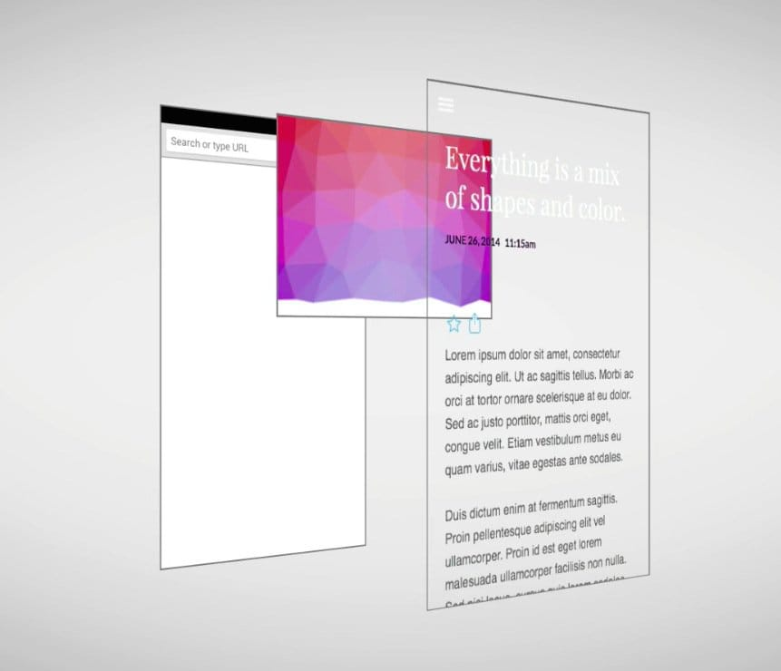
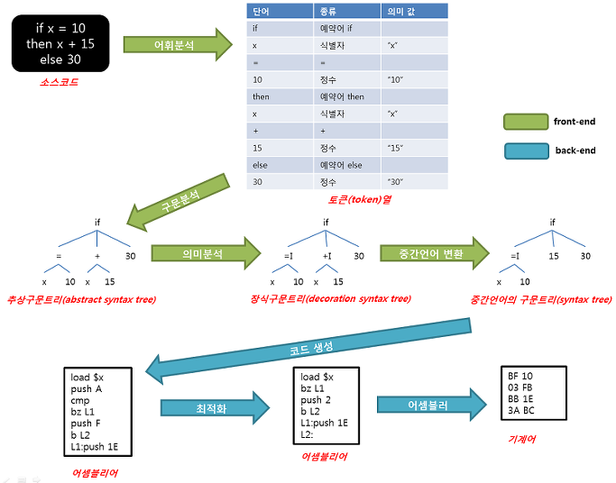

# 목차

a. [폰 노이만 구조](#von-neumann-architecture) \
b. [Operating System](#operating-system) \
&nbsp;&nbsp;&nbsp;&nbsp;1. [System Call](#1-system-call) \
&nbsp;&nbsp;&nbsp;&nbsp;2. [자원 관리](#2-자원-관리) \
c. [Network](#network) \
&nbsp;&nbsp;&nbsp;&nbsp;1. [브라우저에 google.com 치면 일어나는 일](#브라우저에-google.com-치면-일어나는-일) \
&nbsp;&nbsp;&nbsp;&nbsp;2. [Http](#http) \
&nbsp;&nbsp;&nbsp;&nbsp;3. [Url](#url) \
&nbsp;&nbsp;&nbsp;&nbsp;4. [DNS](#dns) \
&nbsp;&nbsp;&nbsp;&nbsp;5. [Packet](#packet) \
&nbsp;&nbsp;&nbsp;&nbsp;6. [OSI Layers on Operating System](#osi-layers-on-os) \
&nbsp;&nbsp;&nbsp;&nbsp;7. [1. Physical Layer](#1-physical-layer) \
&nbsp;&nbsp;&nbsp;&nbsp;8. [2. Datalink Layer](#2-datalink-layer-on-l2-switch(frame)) \
&nbsp;&nbsp;&nbsp;&nbsp;9. [ARP Protocol](#arp-protocol) \
&nbsp;&nbsp;&nbsp;&nbsp;10. [NAT](#nat) \
&nbsp;&nbsp;&nbsp;&nbsp;11. [DMZ](#dmz) \
&nbsp;&nbsp;&nbsp;&nbsp;12. [Firewall](#firewall) \
&nbsp;&nbsp;&nbsp;&nbsp;13. [3. Network Layer](#network-layer-on-l3-switch(packet)) \
&nbsp;&nbsp;&nbsp;&nbsp;14. [3 Way Handshake](#3-way-handshake) \
&nbsp;&nbsp;&nbsp;&nbsp;15. [SSL](#ssl) \
&nbsp;&nbsp;&nbsp;&nbsp;16. [4 Way Handshake](#4-way-handshake) \
d. [규모 확장 시스템 설계 기본](#규모-확장-시스템-설계-기본) \
e. [aws architecture by size](#aws-architecture-by-size) \
&nbsp;&nbsp;&nbsp;&nbsp;1. [사용자가 본인 1명일 때](#1-사용자가-본인-1명일-때) \
&nbsp;&nbsp;&nbsp;&nbsp;2. [사용자가 n명일 때](#2-사용자가-n명일-때) \
&nbsp;&nbsp;&nbsp;&nbsp;3. [사용자가 100명 단위일 때](#3-사용자가-100명-단위일-때) \
&nbsp;&nbsp;&nbsp;&nbsp;4. [사용자가 1000명 단위일 때](#4-사용자가-1000명-단위일-때) \
&nbsp;&nbsp;&nbsp;&nbsp;5. [사용자가 10000명 단위일 때](#5-사용자가-10000명-단위일-때) \
&nbsp;&nbsp;&nbsp;&nbsp;6. [사용자가 50만명 단위일 때](#6-사용자가-50만명-단위일-때) \
&nbsp;&nbsp;&nbsp;&nbsp;7. [사용자가 100만명 단위일 때](#7-사용자가-100만명-단위일-때) \
&nbsp;&nbsp;&nbsp;&nbsp;8. [사용자가 500만명 단위일 때](#8-사용자가-500만명-단위일-때) \
f. [aws architecture for startup](#aws-architecture-for-startup) \
g. [3계층형 시스템](#3계층형-시스템) \
h. [web server](#web-server) \
i. [WAS](#tomcat) \
j. [Spring Security](#spring-security) \
&nbsp;&nbsp;&nbsp;&nbsp;1. [암호화](#암호화) \
&nbsp;&nbsp;&nbsp;&nbsp;2. [대칭 키](#대칭-키) \
&nbsp;&nbsp;&nbsp;&nbsp;3. [비대칭 키](#비대칭-키) \
&nbsp;&nbsp;&nbsp;&nbsp;4. [대칭키 + 비대칭 키](#대칭-키-+-비대칭-키) \
&nbsp;&nbsp;&nbsp;&nbsp;5. [session](#session) \
&nbsp;&nbsp;&nbsp;&nbsp;6. [JWT](#jwt) \
&nbsp;&nbsp;&nbsp;&nbsp;7. [Refresh token](#refresh-token) \
&nbsp;&nbsp;&nbsp;&nbsp;8. [Spring Security basic architecture](#spring-security-basic) \
&nbsp;&nbsp;&nbsp;&nbsp;9. [Spring Security JWT](#spring-security-jwt) \
k. [Spring MVC](#spring-mvc) \
l. [JVM](#jvm) \
m. [JDBC](#jdbc) \
n. [Database](#database) \
o. [Critical Rendering Path](#critical-rendering-path) \
&nbsp;&nbsp;&nbsp;&nbsp;1. [Critical Rendering Path 기본 구조](#1-critical-rendering-path-기본-구조) \
&nbsp;&nbsp;&nbsp;&nbsp;2. [Critical Rendering Path async 최적화](#2-critical-rendering-path-async-최적화) \
p. [Version Control](#version-control) \
&nbsp;&nbsp;&nbsp;&nbsp;1. [Git Overall](#1-git-overall) \
&nbsp;&nbsp;&nbsp;&nbsp;2. [Git Branch](#2-git-branch) \
&nbsp;&nbsp;&nbsp;&nbsp;3. [Git Workflow](#3-git-workflow) \
q. [Compiler](#compiler) \
r. [CI](#github-action-ci)

# Von Neumann Architecture

# Operating System

### 1. System Call

### 2. 자원 관리

# Network

### 브라우저에 google.com 치면 일어나는 일

### http

http request

ex.
http://www.google.com/advisor/selectBeerTaste.do

http response

### url

### DNS

DNS 얻는 과정

1. 자기 PC 메모리 뒤져서 DNS cache 메모리에 google.com에 매핑되는 공인 IP address를 찾음
2. 없으면, 자기 PC에 host 파일 뒤짐.
3. 그래도 없으면, DNS server한테 물어봄.
    1. 대부분 공유기 쓰는데, 공유기는 DNS forwarding 기능 제공함. 그래서 공유기가 응답 해줌
4. 그래도 없으면, ISP(kt,lg,sk)의 root DNS server한테 물음. 응답 오면 DNS cache에 저장해둠. 나중에 또 안물으려고.
5. 그래도 없으면 ICANN에게 물어보고 응답오면 DNS cache에 저장해 둠.

### Packet

최대 사이즈 1500byte(1.5kb)

Q. 만약 1.5MB 사이즈의 파일을 보낸다면?
1. HDD, SSD에서 1.5MB중 64kb 단위로 쪼개서 읽음
2. RAM buffer에 저 쪼갠 64kb 조각들 중 몇개를 올림
3. Application Layer에서 http protocol에 따라 http request 작성
4. Process가 File이든 Socket이든(본질적으로 동일) 입출력 시도하면,
5. RAM buffer에 저장된 64kb 사이즈의 stream형식의 길다란 데이터를 TCP 버퍼에 옮겨 담은 후,
6. Transport Layer에서 encapsulation으로 일정 단위(1460byte)로 끊어서 Segment화 한 후에 번호 붙임(비동기로 쏠건데, 그래야 나중에 서순 재정렬 할 수 있으니까)
7. Network Layer에서 Encapsulation 해서 packet으로 만든다. (1460byte payload data + tcp header 20byte + ip header 20byte == 1500byte)
8. 이걸 또 Datalink Layer에서 encapsulate해서 frame으로 만든다.
9. frame은 DataLink Layer에 LAN card(NIC)을 거쳐서 Router을 거쳐서 인터넷으로 나간다.

data를 보낼 땐,\
7th. Application Layer\
4th. Transport Layer\
3th. Network Layer\
2nd. Datalink Layer\
단계별로 payload + 헤더로 감싸서 보냄.

packet을 받을 땐, 반대로
2nd. Datalink Layer\
3th. Network Layer\
4th. Transport Layer\
7th. Application Layer

헤더 까면서 위층으로 payload보내며 올라감.\
File이건 Socket이건 Stream에 비동기로 오는애들 순서 상관없이 쌓아놓고,
맨 마지막에 한번에 순서 정렬함. 

### OSI Layers on OS

Application Layer에서 app Process가 File이건 Socket이건 소켓을 열어서\
Transport Layer인 TCP에서 Segment를 만들고\
Network Layer인 IP에서 Packet을 만들고\
Datalink Layer인 Device Driver에서 Frame을 만들어서\
Physical Layer인 NIC를 통해 전송

### 1. Physical Layer

voltage가 위로 튀면1, 아래로 튀면 0

어디가 처음인지 어떻게 앎? (ethernet protocol 기준)

1. 맨 처음 0 voltage
2. 처음 데이터 보내기전 56bit의 distinctive pattern의 'preamble'보냄. 101010101010...

3. 11이 갑툭튀함 -> 데이터 보내기 시작한다는 신호

물리층에서 가장 많이 고민하는 사항
1. bandwidth(대역폭) : 몇차선 도로?
2. latency : n차선 도로에서 차가 막히는 정도라고 보면 됨.

### 2. Datalink Layer on L2 Switch(Frame)

1. preamble: physical layer에서 56개의 10101010...
2. B는 destination의 mac 주소. 이 경우, router의 mac 주소.
3. A는 보내는 기기의 mac 주소.

L2 switch\
pass mac address through (hub || bridge || 공유기)\
종류1. hub = 들어온 input 무지성으로 연결된 놈들에게 다 쏨\
종류2. bridge = 들어온 input 무지성으로 다 쏘는게 아니라 Frame(Ethernet protocol) 까봐서 도착지 정해서 보냄.\
종류3. 공유기 = bridge + NAT

### ARP Protocol

LAN안에 내 pc가, 공유기의 MAC Address 몰라서, ARP 날림.

ARP protocol: IP address로 mac address찾는 방법\
라우터의 mac address 찾기

목적지 맥주소 몰라서 FF FF FF FF FF FF로 작성함\
1로 꽉 채운 것. 그럼 LAN안 모두한테 보냄.

중간에 00 00 00 00 00 00이 맥주소 비워둔 것. 도착지 MAC주소 모르니까.\
c0 a8 00 1e도 도착지 ip(라우터 공인ip)를 16진수화 한 것\
ip주소가 안맞으면 요청 무시, 맞으면 본인의 MAC주소 적어 답장

ARP table

### NAT

1. ip 주소 절약
2. 내부 주소 숨김

### DMZ

내부 네트워크에 존재하지만, 외부에서 접근할 수 있는 특수한 네트워크 영역\
내부 네트워크에 바로 접속 못하게 보안목적

### Firewall

1. 패킷 필터형
   1. 통과하는 패킷을 포트 번호나 IP 주소를 바탕으로 필터링한다.
2. 애플리케이션 게이트웨이형
   1. 일종의 프록시 서버
   2. 세션에 포함된 정보 검사하기 위해 기존 세션 종료하고 새로운 세션 만듬
   3. 패킷 필터형에 비해 속도는 느리지만 더 많은 검사 수행 가능 (spoofing 같은..)

### Network Layer on L3 Switch(Packet)

L3 switch
1. router는 한 층에 여러 L2 switch의 요청을 NAT안에서 관리
2. pass IP address

Internet Protocol(IP) Flow

### 3 Way Handshake

정확한 전송 보장 위해 상대방 컴퓨터와 사전에 세션 수립

### SSL
http's' is on ssl

ssl 인증 발급

비대칭키로 대칭키 옮긴 후, 대칭키로 암호화, 복호화

tls handshake

### 4 Way Handshake

TCP 연결했던 세션 종료

# 규모 확장 시스템 설계 기본

# AWS architecture by size

### 1. 사용자가 본인 1명일 때

고정 public IP가 필요해서 Elastic IP 씀.
route53을 통해 해당 IP를 DNS 등록.

### 2. 사용자가 n명일 때

db 인스턴스 분리 on ec2 

### 3. 사용자가 100명 단위일 때

db on ec2에 백업과 같은 작업, 업데이 부담 덜기 위해 RDS 사용.
코어 개발에만 집중

### 4. 사용자가 1000명 단위일 때

이중화 함
앞에 load balancer 붙여줌
RDB의 Multi-AZ옵션 사용해서 Master-Standby db로 나눠 backup 관리 

### 5. 사용자가 10000명 단위일 때

backend-app의 인스턴스 수 늘림.
Master db에 부하가 심해지니까, read-only replica db 만들어 부하 분산

static file들 s3 && clount front로 이전, WAS에 부하 분산

session 정보, app의 임시정보를 모두 ec2 instance에서 관리하지 말고,
Elastic cache의 Redis나 DynamoDB로 관리

동적 컨텐츠도 CloudFront이용해서 CDN으로 처리해서 ec2 WAS 부하 분산 

### 6. 사용자가 50만명 단위일 때

CloudWatch로 auto scaling(up+out)
모든 작업들에 대해 자동화, 모니터링, 로그분석, 이슈에 대한 대응방안 필요

### 7. 사용자가 100만명 단위일 때

앞에 언급된 모든 요소 점검
1. Multi-AZ
2. 계층간 로드 밸런싱
3. 오토 스케일링
4. 느슨한 결합과 서비스 재활용
5. 효율적인 컨텐츠 제공
6. DB 캐싱과 읽기작업 부하 오프 로를 위한 읽기 전용 복제본 설정
7. 오토 스케일하는 계층의 세션 상태 이전

### 8. 사용자가 500만명 단위일 때
이정도 유저 사이즈면 아무리 경량화 해도 db write에 병목 발생함.

1. Federation

데이터 베이스를 기능 및 목적에 따라 분리. 
db간 교차-함수 쿼리가 어려움
 

2. Sharding

db를 용도에 맞게 분리화 하더라도, db 테이블 자체가 너무 크거나,
교차-함수 쿼리가 어려우면, 수평적 확장인 샤딩 고려.

3. 특정 기능을 다른 종류의 DB로 변경

NoSQL 도입 검토

관리형 NoSQL 서비스인 DynamoDB 이용

관계형으로 정의할 수 있는 데이터가 아닌, 정제되지 않은 데이터를 저장해야 한다면 적합

ex)
리더보드/득점표
클릭스트림 및 로그 데이터의 빠른 인 업
임시 데이터(장바구니)
핫 테이블
메타 데이터 / 검색 테이블

# aws architecture for startup

### 1. 요약
1. 데이터 흐름
2. VPC 생성
3. Subnet 생성
4. Internet Gateway, NAT Gateway 생성
5. Routing Table, Network ACL 설정
6. AWS Lambda를 Private Subnet에서 구성

### 2. 데이터 흐름
a. User
1. CloudFront를 통해 S3에서 호스팅 되는 React App 접속 
2. Route53을 통해 Internet Gateway로 이동
3. ALB를 통해 Public Subnet 라우팅 테이블로 이동
4. 라우팅 테이블에서 ALB 를 통해 접근한 트래픽은 어플리케이션으로 트래픽을 보냄
5. 정상적이지 않은 접근일 경우 다시 Internet Gateway로 포워딩
6. EB 어플리케이션은 내부 IP를 사용하여 MySQL에 접근

b. DevOps
1. EC2 접근 최소화
2. 굳이 접근 해야 한다면, Bastion 서버를 중간에 두고 접근
3. 로그 등은 반드시 언제든 확인할 수 있는 시스템을 갖추어야 한다.
3. 데이터 베이스 접근 역시 Bastion 서버를 중간에 두고 접근
4. 굳이 Bastion 서버가 아니더라도 VPN 등을 두고 접근을 실시한다.

c. Lambda
1. Lambda가 Private Subnet 에서 생성됨 
2. 인터넷을 사용해야 할 경우 Public Subnet 에 있는 NAT Gateway를 통해 인터넷에 접근함
3. 데이터베이스 사용시 내부IP를 이용하여 데이터베이스에 접근

# 3계층형 시스템

# Web Server

# Tomcat

# Spring Security

### 암호화

### 대칭 키

### 비대칭 키

공개키와 비밀키는 대칭이다.\
공개키로 잠긴 문서는 비밀키로만 unlock 가능하다.

### 대칭 키 + 비대칭 키
비대칭키를 대칭키 교환용으로 사용.\
왜? 비대칭키 느림, 대칭키 빠름.

---
step1) server.secretKey -> client

(2)에서 서버의 공개키를 client에게 주면,\
(3)에서 client가 서버의 공개키로 자신의 private key를 암호화 해서\
(4,5)server.publicKey(client.secretKey)를 서버로 보냄\
(6)에서 서버는 server.secretKey로 server.publicKey로 암호화 된 client.secretKey를 복호화함.

---
step2) client.secretKey -> server

(2~6)를 입장 바꿔서 반복

---
step3) handshake 이후 대칭키 통신

(7,8)서버는 클라이언트에게 client.privateKey잘 받았다고 통보. client: 오키\
(9)client-server는 이제부터 대칭 키 방식으로 동작함.

### session

### jwt
why?

1. 유저 정보 서버에서 보관 -> 클라이언트에서 보관 (부하)
2. no more slow db io for session-validation
3. session is bad at scale-out

1. client->server 로그인 성공
2. (header + payload + 서버의 secret key)로 암호화 한 jwt을 client에게 줌
3. client는 이제부터 항상 http header에 jwt token을 첨부해서 보냄
4. 서버는 jwt토큰을 서버의 secret key로 복호화 해서 유저가 보낸게 맞다는걸 인증(authenticate)함.

1. header -> who is issuer is + expiration date
2. payload -> additional infos
3. signiture -> encrypt(header, payload, server.secretKey)

### refresh token
why?
1. jwt token 유효기한 1년인데 탈취 당하면 1년동안 자유이용권 
2. 유효기간 짧게, refresh token으로 재갱신하게 하면, jwt token 털려도 잠깐동안만 이용 가능

### Spring Security Basic

### Spring Security JWT

# Spring MVC

# JVM

# JDBC

# Database

# Critical Rendering Path

### 1. Critical Rendering Path 기본 구조
 \
 \
byte -> DOM Tree

 \
DOM Tree + CSSOM Tree -> Render Tree

 \
Layout

 \
pixel

 \
Paint (Render Tree in Layout with Pixel)

### 2. Critical Rendering Path Async 최적화

 \
 \
일반적 요청 순서

 \
css, js를 async로 non-blocking로 요청

# Version Control

### 1. Git Overall

### 2. Git Branch

### 3. Git Workflow

# Compiler

# Github-Action CI

commit, push 하면 github에 별도 서버에서 build & test + alpha 해줌

