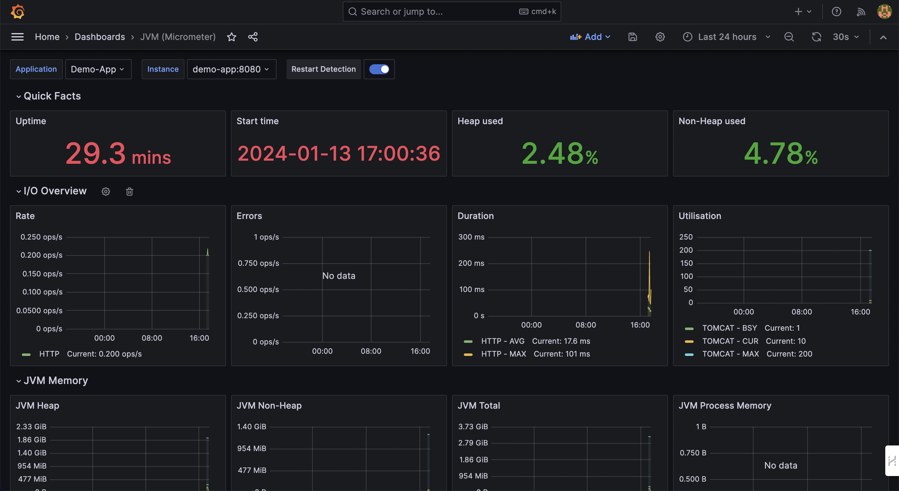

## A. Spring Boot + Prometheus + Grafana

Running Spring Boot App Monitoring suite with Prometheus and Grafana

| App  | URL  |
|---|---|
| App | [http://localhost:8080/](http://localhost:8080/) |
| Prometheus | [http://localhost:9090/graph](http://localhost:9090/graph) |
| Grafana  | [http://localhost:3000](http://localhost:3000)  |
| Spring Boot Actuator | [http://localhost:8080/actuator/metrics](http://localhost:8080/actuator/metrics)

# B. how to run?

1. docker compose up -d --build
2. [http://localhost:9090/graph](http://localhost:9090/graph) -> 프로메테우스 접속
3. 프로메테우스에 status 메뉴에 targets 클릭 -> endpoint에 http://demo-app:8080/actuator/prometheus 가 떠 있는걸 확인 가능하다.
4. prometheus.graph -> expression에서 내가 원하는 metrics 클릭 -> execute 하면 결과를 볼 수 있다. 근데 Prometheus에서 보는게 ui가 별로니까, grafana로 본다.
5. http://localhost:3000/ 에서 admin/admin 치고 로그인 후,
6. add datasource -> prometheus 선택. url에 http://localhost:9090 입력 후(docker compose up으로 실행한 경우, prometheus에 container ip를 넣어줘야 한다.) save
	- docker inspect ${prometheus-container-id} 에 "IPAdress" 주소를 복붙한다.
7. dashboard -> import -> https://grafana.com/grafana/dashboards/4701-jvm-micrometer/ 를 입력한다.
	- 가장 유명한 대시보드이다
8. grafana dashboard를 확인한다.
	- last 24 hours -> last 5 min으로 바꿔서 보자

9. dashboard -> add panel -> Metric에서 원하는 지표 선택 -> Apply
10. docker-compose down


# C. 설명

## a. what is spring actuator?
스프링 모니터링할 때 필요한 서버 정보 보여줌.

http://localhost:8080/actuator/ 하면, 어느 정보의 url을 보고싶은지 리스트가 나옴.\
ex. localhost:8080/actuator/env 를 하면, {"status":"UP"} 이렇게 서버가 떠있다고 나옴.


## b. spring actuator에서 제공하는 정보 리스트?
actuator에서 제공하는 정보의 default는 http://localhost:8080/actuator/metrics 이거인데,
아래의 정보를 얻을 수 있음.

```json
{"names":["jvm.classes.unloaded","tomcat.sessions.active.current","jvm.buffer.count","jvm.memory.used","tomcat.threads.busy","tomcat.sessions.alive.max","jvm.gc.live.data.size","jvm.buffer.total.capacity","jvm.memory.max","jvm.memory.committed","jvm.gc.pause","process.files.open","jvm.threads.states","tomcat.sessions.active.max","http.server.requests","jvm.buffer.memory.used","process.start.time","logback.events","tomcat.global.sent","process.files.max","jvm.gc.memory.promoted","tomcat.global.request.max","system.load.average.1m","tomcat.global.request","jvm.gc.max.data.size","system.cpu.count","tomcat.global.received","tomcat.sessions.created","jvm.threads.daemon","system.cpu.usage","jvm.gc.memory.allocated","tomcat.threads.config.max","tomcat.sessions.expired","jvm.threads.live","jvm.threads.peak","tomcat.global.error","process.uptime","tomcat.sessions.rejected","tomcat.threads.current","process.cpu.usage","jvm.classes.loaded"]}
```

build.gradle에 스프링 부트용 프로메테우스 라이브러리를 설치 & 실행하면,
http://localhost:8080/actuator/prometheus 에 프로메테우스에 제공하는 메트릭 정보를 볼 수 있다.

```
# HELP jvm_threads_live_threads The current number of live threads including both daemon and non-daemon threads
# TYPE jvm_threads_live_threads gauge
jvm_threads_live_threads{application="Demo-App",instance="Demo-Instance",} 20.0
# HELP tomcat_threads_config_max_threads
# TYPE tomcat_threads_config_max_threads gauge
tomcat_threads_config_max_threads{application="Demo-App",instance="Demo-Instance",name="http-nio-8080",} 200.0
# HELP process_start_time_seconds Start time of the process since unix epoch.
# TYPE process_start_time_seconds gauge
process_start_time_seconds{application="Demo-App",instance="Demo-Instance",} 1.705132836025E9
# HELP tomcat_global_sent_bytes_total
# TYPE tomcat_global_sent_bytes_total counter
tomcat_global_sent_bytes_total{application="Demo-App",instance="Demo-Instance",name="http-nio-8080",} 7024413.0
# HELP jvm_buffer_count_buffers An estimate of the number of buffers in the pool
# TYPE jvm_buffer_count_buffers gauge
jvm_buffer_count_buffers{application="Demo-App",id="direct",instance="Demo-Instance",} 10.0
jvm_buffer_count_buffers{application="Demo-App",id="mapped",instance="Demo-Instance",} 0.0
# HELP logback_events_total Number of error level events that made it to the logs
# TYPE logback_events_total counter
logback_events_total{application="Demo-App",instance="Demo-Instance",level="warn",} 0.0
logback_events_total{application="Demo-App",instance="Demo-Instance",level="debug",} 1038.0
logback_events_total{application="Demo-App",instance="Demo-Instance",level="error",} 0.0
logback_events_total{application="Demo-App",instance="Demo-Instance",level="trace",} 0.0
logback_events_total{application="Demo-App",instance="Demo-Instance",level="info",} 7.0
# HELP jvm_buffer_memory_used_bytes An estimate of the memory that the Java virtual machine is using for this buffer pool
# TYPE jvm_buffer_memory_used_bytes gauge
jvm_buffer_memory_used_bytes{application="Demo-App",id="direct",instance="Demo-Instance",} 81920.0
jvm_buffer_memory_used_bytes{application="Demo-App",id="mapped",instance="Demo-Instance",} 0.0
# HELP jvm_gc_pause_seconds Time spent in GC pause
# TYPE jvm_gc_pause_seconds summary
jvm_gc_pause_seconds_count{action="end of minor GC",application="Demo-App",cause="Metadata GC Threshold",instance="Demo-Instance",} 1.0
jvm_gc_pause_seconds_sum{action="end of minor GC",application="Demo-App",cause="Metadata GC Threshold",instance="Demo-Instance",} 0.07
jvm_gc_pause_seconds_count{action="end of minor GC",application="Demo-App",cause="Allocation Failure",instance="Demo-Instance",} 1.0
jvm_gc_pause_seconds_sum{action="end of minor GC",application="Demo-App",cause="Allocation Failure",instance="Demo-Instance",} 0.146
jvm_gc_pause_seconds_count{action="end of major GC",application="Demo-App",cause="Metadata GC Threshold",instance="Demo-Instance",} 1.0
jvm_gc_pause_seconds_sum{action="end of major GC",application="Demo-App",cause="Metadata GC Threshold",instance="Demo-Instance",} 0.447
# HELP jvm_gc_pause_seconds_max Time spent in GC pause
# TYPE jvm_gc_pause_seconds_max gauge
jvm_gc_pause_seconds_max{action="end of minor GC",application="Demo-App",cause="Metadata GC Threshold",instance="Demo-Instance",} 0.0
jvm_gc_pause_seconds_max{action="end of minor GC",application="Demo-App",cause="Allocation Failure",instance="Demo-Instance",} 0.0
jvm_gc_pause_seconds_max{action="end of major GC",application="Demo-App",cause="Metadata GC Threshold",instance="Demo-Instance",} 0.0
# HELP jvm_gc_live_data_size_bytes Size of old generation memory pool after a full GC
# TYPE jvm_gc_live_data_size_bytes gauge
jvm_gc_live_data_size_bytes{application="Demo-App",instance="Demo-Instance",} 1.3931824E7
# HELP tomcat_sessions_expired_sessions_total
# TYPE tomcat_sessions_expired_sessions_total counter
tomcat_sessions_expired_sessions_total{application="Demo-App",instance="Demo-Instance",} 0.0
# HELP tomcat_sessions_active_current_sessions
# TYPE tomcat_sessions_active_current_sessions gauge
tomcat_sessions_active_current_sessions{application="Demo-App",instance="Demo-Instance",} 0.0
# HELP jvm_gc_memory_promoted_bytes_total Count of positive increases in the size of the old generation memory pool before GC to after GC
# TYPE jvm_gc_memory_promoted_bytes_total counter
jvm_gc_memory_promoted_bytes_total{application="Demo-App",instance="Demo-Instance",} 9340056.0
# HELP jvm_classes_unloaded_classes_total The total number of classes unloaded since the Java virtual machine has started execution
# TYPE jvm_classes_unloaded_classes_total counter
jvm_classes_unloaded_classes_total{application="Demo-App",instance="Demo-Instance",} 1.0
# HELP tomcat_sessions_created_sessions_total
# TYPE tomcat_sessions_created_sessions_total counter
tomcat_sessions_created_sessions_total{application="Demo-App",instance="Demo-Instance",} 0.0
# HELP jvm_threads_daemon_threads The current number of live daemon threads
# TYPE jvm_threads_daemon_threads gauge
jvm_threads_daemon_threads{application="Demo-App",instance="Demo-Instance",} 16.0
# HELP process_files_max_files The maximum file descriptor count
# TYPE process_files_max_files gauge
process_files_max_files{application="Demo-App",instance="Demo-Instance",} 1048576.0
# HELP jvm_threads_states_threads The current number of threads having NEW state
# TYPE jvm_threads_states_threads gauge
jvm_threads_states_threads{application="Demo-App",instance="Demo-Instance",state="runnable",} 6.0
jvm_threads_states_threads{application="Demo-App",instance="Demo-Instance",state="blocked",} 0.0
jvm_threads_states_threads{application="Demo-App",instance="Demo-Instance",state="waiting",} 12.0
jvm_threads_states_threads{application="Demo-App",instance="Demo-Instance",state="timed-waiting",} 2.0
jvm_threads_states_threads{application="Demo-App",instance="Demo-Instance",state="new",} 0.0
jvm_threads_states_threads{application="Demo-App",instance="Demo-Instance",state="terminated",} 0.0
# HELP jvm_classes_loaded_classes The number of classes that are currently loaded in the Java virtual machine
# TYPE jvm_classes_loaded_classes gauge
jvm_classes_loaded_classes{application="Demo-App",instance="Demo-Instance",} 7569.0
# HELP process_uptime_seconds The uptime of the Java virtual machine
# TYPE process_uptime_seconds gauge
process_uptime_seconds{application="Demo-App",instance="Demo-Instance",} 2610.548
# HELP process_cpu_usage The "recent cpu usage" for the Java Virtual Machine process
# TYPE process_cpu_usage gauge
process_cpu_usage{application="Demo-App",instance="Demo-Instance",} 0.0
# HELP tomcat_sessions_rejected_sessions_total
# TYPE tomcat_sessions_rejected_sessions_total counter
tomcat_sessions_rejected_sessions_total{application="Demo-App",instance="Demo-Instance",} 0.0
# HELP http_server_requests_seconds
# TYPE http_server_requests_seconds summary
http_server_requests_seconds_count{application="Demo-App",exception="None",instance="Demo-Instance",method="GET",outcome="SUCCESS",status="200",uri="/**/favicon.ico",} 1.0
http_server_requests_seconds_sum{application="Demo-App",exception="None",instance="Demo-Instance",method="GET",outcome="SUCCESS",status="200",uri="/**/favicon.ico",} 0.24582525
http_server_requests_seconds_count{application="Demo-App",exception="None",instance="Demo-Instance",method="GET",outcome="SUCCESS",status="200",uri="/actuator/prometheus",} 517.0
http_server_requests_seconds_sum{application="Demo-App",exception="None",instance="Demo-Instance",method="GET",outcome="SUCCESS",status="200",uri="/actuator/prometheus",} 16.118020964
# HELP http_server_requests_seconds_max
# TYPE http_server_requests_seconds_max gauge
http_server_requests_seconds_max{application="Demo-App",exception="None",instance="Demo-Instance",method="GET",outcome="SUCCESS",status="200",uri="/**/favicon.ico",} 0.0
http_server_requests_seconds_max{application="Demo-App",exception="None",instance="Demo-Instance",method="GET",outcome="SUCCESS",status="200",uri="/actuator/prometheus",} 0.043623209
# HELP tomcat_global_request_max_seconds
# TYPE tomcat_global_request_max_seconds gauge
tomcat_global_request_max_seconds{application="Demo-App",instance="Demo-Instance",name="http-nio-8080",} 0.937
# HELP jvm_memory_max_bytes The maximum amount of memory in bytes that can be used for memory management
# TYPE jvm_memory_max_bytes gauge
jvm_memory_max_bytes{application="Demo-App",area="nonheap",id="Code Cache",instance="Demo-Instance",} 2.5165824E8
jvm_memory_max_bytes{application="Demo-App",area="heap",id="PS Eden Space",instance="Demo-Instance",} 6.77380096E8
jvm_memory_max_bytes{application="Demo-App",area="heap",id="PS Old Gen",instance="Demo-Instance",} 1.389887488E9
jvm_memory_max_bytes{application="Demo-App",area="nonheap",id="Compressed Class Space",instance="Demo-Instance",} 1.073741824E9
jvm_memory_max_bytes{application="Demo-App",area="nonheap",id="Metaspace",instance="Demo-Instance",} -1.0
jvm_memory_max_bytes{application="Demo-App",area="heap",id="PS Survivor Space",instance="Demo-Instance",} 8912896.0
# HELP system_cpu_usage The "recent cpu usage" for the whole system
# TYPE system_cpu_usage gauge
system_cpu_usage{application="Demo-App",instance="Demo-Instance",} 0.04501607717041801
# HELP tomcat_sessions_active_max_sessions
# TYPE tomcat_sessions_active_max_sessions gauge
tomcat_sessions_active_max_sessions{application="Demo-App",instance="Demo-Instance",} 0.0
# HELP system_load_average_1m The sum of the number of runnable entities queued to available processors and the number of runnable entities running on the available processors averaged over a period of time
# TYPE system_load_average_1m gauge
system_load_average_1m{application="Demo-App",instance="Demo-Instance",} 0.0
# HELP tomcat_global_error_total
# TYPE tomcat_global_error_total counter
tomcat_global_error_total{application="Demo-App",instance="Demo-Instance",name="http-nio-8080",} 1.0
# HELP jvm_threads_peak_threads The peak live thread count since the Java virtual machine started or peak was reset
# TYPE jvm_threads_peak_threads gauge
jvm_threads_peak_threads{application="Demo-App",instance="Demo-Instance",} 20.0
# HELP jvm_gc_memory_allocated_bytes_total Incremented for an increase in the size of the young generation memory pool after one GC to before the next
# TYPE jvm_gc_memory_allocated_bytes_total counter
jvm_gc_memory_allocated_bytes_total{application="Demo-App",instance="Demo-Instance",} 3.46758792E8
# HELP system_cpu_count The number of processors available to the Java virtual machine
# TYPE system_cpu_count gauge
system_cpu_count{application="Demo-App",instance="Demo-Instance",} 4.0
# HELP jvm_gc_max_data_size_bytes Max size of old generation memory pool
# TYPE jvm_gc_max_data_size_bytes gauge
jvm_gc_max_data_size_bytes{application="Demo-App",instance="Demo-Instance",} 1.389887488E9
# HELP tomcat_threads_current_threads
# TYPE tomcat_threads_current_threads gauge
tomcat_threads_current_threads{application="Demo-App",instance="Demo-Instance",name="http-nio-8080",} 10.0
# HELP jvm_buffer_total_capacity_bytes An estimate of the total capacity of the buffers in this pool
# TYPE jvm_buffer_total_capacity_bytes gauge
jvm_buffer_total_capacity_bytes{application="Demo-App",id="direct",instance="Demo-Instance",} 81920.0
jvm_buffer_total_capacity_bytes{application="Demo-App",id="mapped",instance="Demo-Instance",} 0.0
# HELP jvm_memory_used_bytes The amount of used memory
# TYPE jvm_memory_used_bytes gauge
jvm_memory_used_bytes{application="Demo-App",area="nonheap",id="Code Cache",instance="Demo-Instance",} 1.8239424E7
jvm_memory_used_bytes{application="Demo-App",area="heap",id="PS Eden Space",instance="Demo-Instance",} 1.09261184E8
jvm_memory_used_bytes{application="Demo-App",area="heap",id="PS Old Gen",instance="Demo-Instance",} 1.3940016E7
jvm_memory_used_bytes{application="Demo-App",area="nonheap",id="Compressed Class Space",instance="Demo-Instance",} 4970624.0
jvm_memory_used_bytes{application="Demo-App",area="nonheap",id="Metaspace",instance="Demo-Instance",} 4.1710968E7
jvm_memory_used_bytes{application="Demo-App",area="heap",id="PS Survivor Space",instance="Demo-Instance",} 4582128.0
# HELP tomcat_threads_busy_threads
# TYPE tomcat_threads_busy_threads gauge
tomcat_threads_busy_threads{application="Demo-App",instance="Demo-Instance",name="http-nio-8080",} 1.0
# HELP process_files_open_files The open file descriptor count
# TYPE process_files_open_files gauge
process_files_open_files{application="Demo-App",instance="Demo-Instance",} 25.0
# HELP tomcat_global_request_seconds
# TYPE tomcat_global_request_seconds summary
tomcat_global_request_seconds_count{application="Demo-App",instance="Demo-Instance",name="http-nio-8080",} 519.0
tomcat_global_request_seconds_sum{application="Demo-App",instance="Demo-Instance",name="http-nio-8080",} 18.281
# HELP jvm_memory_committed_bytes The amount of memory in bytes that is committed for the Java virtual machine to use
# TYPE jvm_memory_committed_bytes gauge
jvm_memory_committed_bytes{application="Demo-App",area="nonheap",id="Code Cache",instance="Demo-Instance",} 1.835008E7
jvm_memory_committed_bytes{application="Demo-App",area="heap",id="PS Eden Space",instance="Demo-Instance",} 2.39599616E8
jvm_memory_committed_bytes{application="Demo-App",area="heap",id="PS Old Gen",instance="Demo-Instance",} 6.6584576E7
jvm_memory_committed_bytes{application="Demo-App",area="nonheap",id="Compressed Class Space",instance="Demo-Instance",} 5505024.0
jvm_memory_committed_bytes{application="Demo-App",area="nonheap",id="Metaspace",instance="Demo-Instance",} 4.4302336E7
jvm_memory_committed_bytes{application="Demo-App",area="heap",id="PS Survivor Space",instance="Demo-Instance",} 8912896.0
# HELP tomcat_global_received_bytes_total
# TYPE tomcat_global_received_bytes_total counter
tomcat_global_received_bytes_total{application="Demo-App",instance="Demo-Instance",name="http-nio-8080",} 0.0
# HELP tomcat_sessions_alive_max_seconds
# TYPE tomcat_sessions_alive_max_seconds gauge
tomcat_sessions_alive_max_seconds{application="Demo-App",instance="Demo-Instance",} 0.0
```


## c. prometheus 쓰는 이유?
1. 단일 springboot app의 metrics 뿐만 아니라, 스케일 아웃된 여러 인스턴스의 metrics들을 하나의 prometheus 서버에 모아준다.
2. db monitoring도 해준다.
3. 뿐만 아니라 metric이 특정 임계점에 도달하면(ex. 서비스가 죽었다거나, CPU 점유율이 80% 이상 찍었다거나..) 알람 보내는 기능도 있다.


## d. grafana 쓰는 이유?
프로메테우스 UI가 있긴 한데, 보기가 불편하니까
시계열 데이터 visualization 전문 툴인 grafana 쓰는 것.

