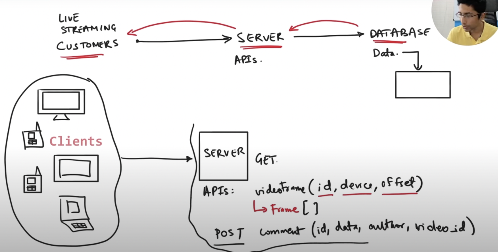
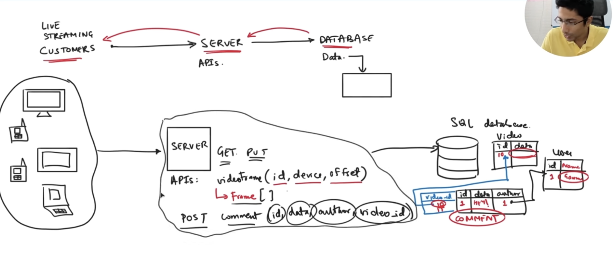
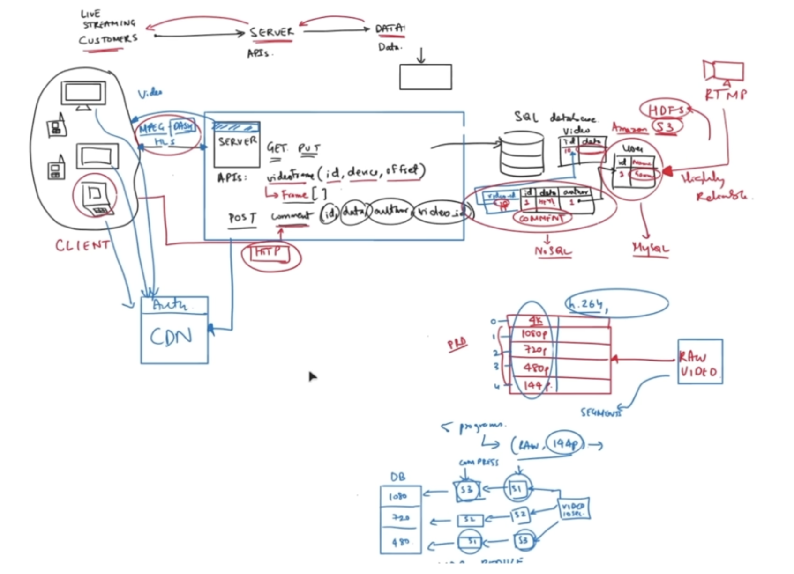
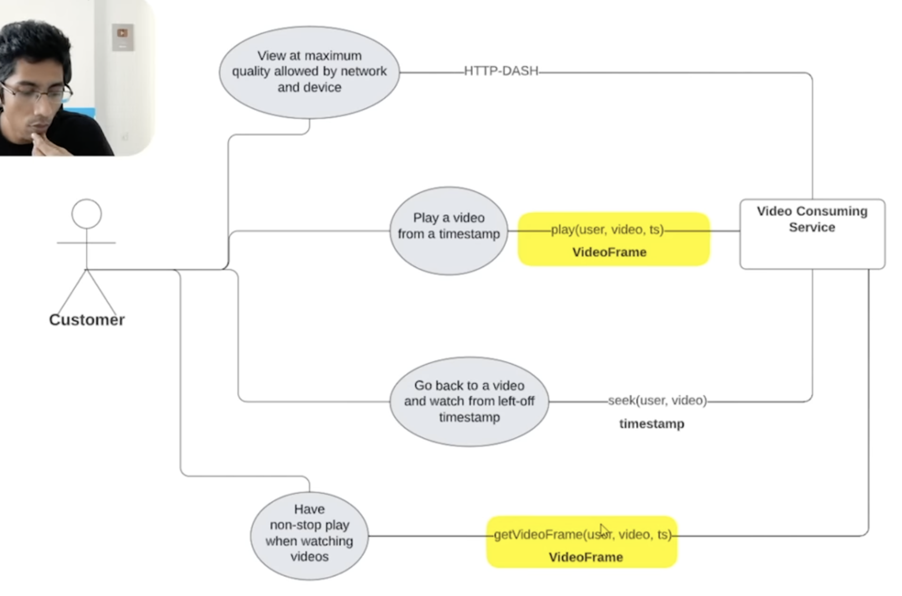
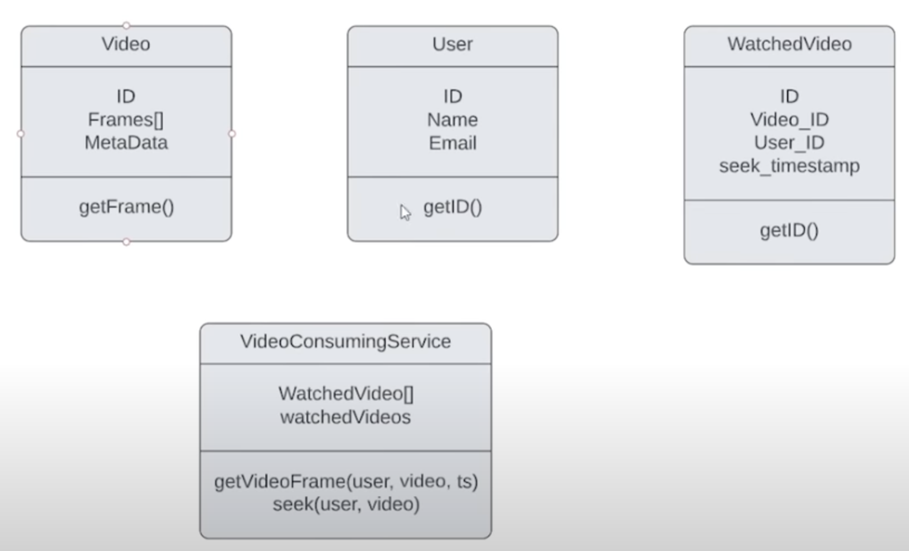
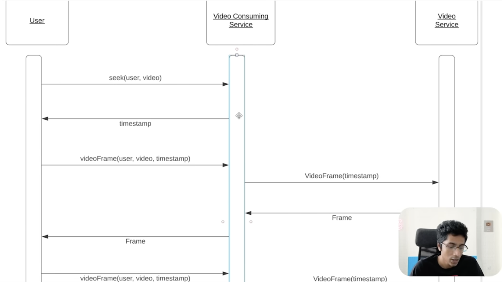
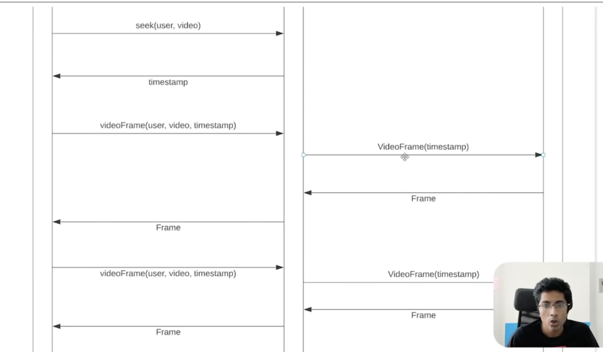
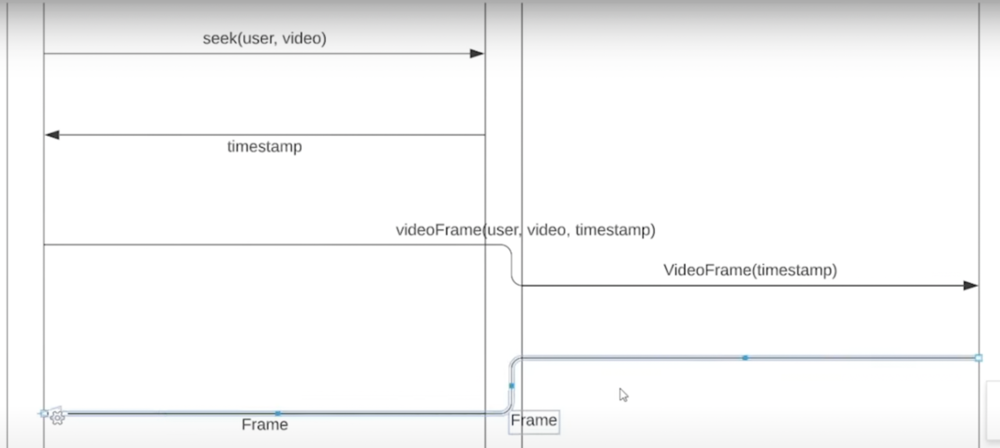

# A. high level blue print design
## A.1. principles for high level design
### A.1.1. define most important requirements
- what are the 'most important' requirements?

ex.
- should be able to see the video
	- server doesn't go down
	- bandwidth requirement is sufficient
	- resolution is secondary issue

think of (optional) features later


### A.1.2. abstract idea -> 설계, 코드
- abstract business language -> code

ex.
user likes a particular comment


1. product requirement doc
2. features / abstract concepts
3. data definition
4. objects
5. map to database


then, design API endpoint to communicate between server and database


### A.1.3. engineering requirements
- engineering requirements


1. fault-tolerance(HA)
	- 전세계에 서버가 있어서, 모든 나라에서 accessible + multiple servers in each country for HA. server is not down
2. extensibility
	- your code should be extensible
	- ex. id를 string으로 작성하기. database compatibility를 위해
	- for later scalabillity, later complexity
3. testing
	- how to test a code?
	- ex. requirements of live-streaming service
		1. streaming video
		2. processing video
		3. broadcasting
		4. fail proof
		5. advertisements
		6. reactions
		7. disclaimers / news flashes
		8. degradation of video quality
		9. allowing multiple device support
	- 비디오 클릭해서 뜰 때 까지 시간이 ms 단위. 졸라 빨라야 함.

## A.2. system design

### A.2.1. api modeling



1. database 먼저 모델링 한 후,
2. server api 모델링 한 후,
3. customer쪽 생각하는 data driven 방식? 이 있는가 반면,

반대로 customer쪽에서 부터, 어떤 device 쓰고, 어떤 종류의 고객이 요청할거냐 부터 디자인 하는 방법이 있음.

either way works fine


API modeling 이후,


### A.2.2. database modeling



일단 하이레벨, 러프한 그림 그리는게,  중요
good to start

### A.2.3. network protocol 정하기
1. stateful protocol vs stateless protocol?
	- comment는 http protocol을 쓴다
	- TCP: for reliable protocol
2. video frame를 위한 network protocol을 정한다.
	- RTMP: real time media protocol
	- there is specific protocol designed for video
	- UDP: real time efficient protocol
3. protocol for streaming
	- compare these 3 protocols
		1. webRTC
		2. mpeg dash
		3. HLS
4. protocol to communicate between backend server?
	1. gRPC
5. protocol for server to communciate with database server?

Q. 만약 http-DASH 프로토콜이 뭔지 물어본다면?
1. 미리 논문 읽어서 이해한 후 설명하거나
2. 예측도 가능.(물론 걍 예측한다고 말해야 함)

### A.2.4. backend communication design patterns 정하기
1. comment는 request-response
2. video는? short polling?
3. alarm은? push - SSE(server-sent-event)
4. chatting은? web socket 양방향?


### A.2.5. select database
- Relational Database?
- NOSQL database?
- graph database?
- s3 bucket?


## A.3. finish high level blue print
### A.3.1. map reduce for video transformation
- resolution
	1. 144p
	2. 480p
	3. 720p
	4. 1080p
	5. 4k

a raw video should be converted to these resolutions
map reduce 패턴으로, 다른 resolution으로 convert

### A.3.2. consider CDN
for high performance




# B. low level design
## B.1. principle for low level design
1. lower-level design will mainly be about
	1. memory optimization
	2. user behavior
	3. api calling
	4. concurrency
	5. latency / throughput
2. you can't design them all, so focus on most important feature
	- ex. how does user fetch/view the video? (important)
	- we are not considering how to onboard a video, etc (less important)
3. what are user's action on that most important features?
	- ex. play/pause the video
	- when a video is paused, do you continue to fetch the video segments? or stop fetching?
	- if you do fetch more fragment when paused, how many seconds/minutes will you fetch more?
	- 1hr video에서 20분까지 보고, 창 닫고 나중에 다시 접속했는데, 20분 cached 해놔야 UX가 좋아짐
		- Q. how to cache it?
		- Q. are you going to cache on all videos users watched? or some?
		- Q. if some, under what criteria?

## B.2. UML

### B.2.1. draw usecase diagram

actor가 어떤 action을 취할 것인지, [[UML]] flowchart로 흐름 그리기


if these use-cases are satisfied, user is happy =)

use-case diagram behaves like a foundation to come up with class diagram

---
thinking in terms of APIs
(clear your api model is, easier your low level design will be)

어떤 API를 어떤 목적으로 요청하고, 어떤 response를 받을건지 적기




Q. play a video from a timestamp & have non-stop play when watching video look very similar. should we merge them?

A. business-wise, they are two different features.
1. play a video from a timestamp -> 유저가 해당 부분을 선호한다는 '정보'가 들어감
	1. this timestamp is 'exciting' part of video! highlight of video!
	2. used for business analytics
2. whereas, non-stop play를 위한 video frame을 미리 받는 요청은, 위의 정보가 없음.
	1. used for UX

이 둘을 유저 behavior tracking를 고려하면 구분,
그런데 behavior tracking 시스템이 없으면 어짜피 기능이 같으니까 합쳐도 무관.


### B.2.2. class diagram

- use-case diagram behaves like a foundation to come up with class diagram
- comprised of
	- class
		1. states
			- states are data that object need to perform the behaviors
		2. behavior




you define what state, what behavior are possible for each object in our system


### B.2.3. sequence diagram
why: class diagram에서는, 어떤 sequence로 각 object들이 state를 input받으면, 그걸 기반으로 behave(action) 하는지 모호하기 때문에, sequence diagram을 그려서 명확하게 한다.


important!
video service has no idea who the user is. doesnt care
stateless!





1. tcp handshake하듯, seek()로 먼저 연결한 다음,
2. 그 이후부터는 videoFrame을 요청시 마다 받아옴

단점: video frame 요청이 너무 잦기 때문에, video consuming service server가 요청이 너무 많을 수 있다.




따라서 seek()같은 handshake만 video consuming server에서 하고,
비디오 frame 요청은 client -> video service server로 direct 요청하게 바꾼다.


## B.3. UML -> code

```java
class Frame {
	public static int frameTime = 10;
	byte[] bytes;
	int startTimestamp;
	int endTimeStamp;
}

class Video{
	String id;
	Frame[] frames;
	String jsonMetaData;

	public Frame getFrame(int timestamp){
		for(int i = 0; i < frames.length; i++){
			if(frames[i].startTimestamp <= timestamp && frames[i].endTimestamp > timestamp){
				return frames[i];
			}
		}
		throw new IndexOutOfBoundsException();
	}
}

class User {
	String id;
	String name;
	String email;

	public String getId(){
		return id;
	}
}

class WatchedVideo {
	String id;
	String videoId;
	String userId;
	int seekTime;

	public int getSeekTime(){
		return seekTime;
	}
}

class VideoConsumingService {

	private Database database;

	public int seekTime(String userId, String videoId){
		WatchedVideo watchedVideo = database.getWatchedVideo(userId, videoId);
		return watchedVideo.getSeekTime();
	}
}

class Database {
	//dummy object
}

class VideoService {
	private FileSystem fileSystem;

	public Frame getFrame(String videoId, int timeStamp) {
		Video video = fileSystem.getVideo(videoId);
		return video.getFrame(timeStamp);
	}
}
```


---

ref: [system design crash course](https://www.youtube.com/watch?v=m8Icp_Cid5o)
