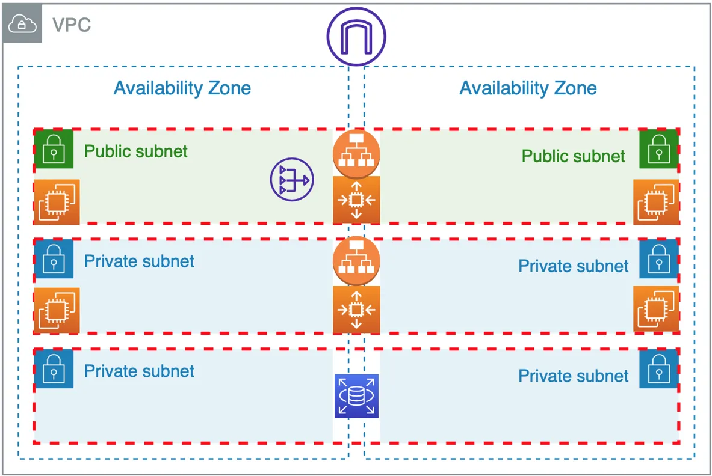
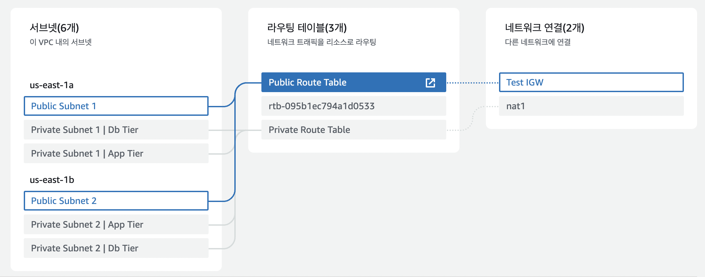

# A. 3 tier architecture

Creating AWS resources for a 3-tier architecture using terraform

1. Internet Gateway에 public route table이 붙고,
2. 그 public route table에 두개의 AZ에 나누어진 public subnet에 붙음
3. 각각 public subnet마다 1개의 ec2 instance with public ip가 있다.
4. ALB(L7 layer, application load balancer)가 이 두 public subnet의 ec2 instance에 붙어있다.

1. nat gateway는 public subnet에 연결되있어서, outbound 요청 through igw 함(ex. git clone) 근데 private subnet이니까 inbound 요청은 막음
2. private nat gateway에 private route table에 붙고,
3. private route table에 두개의 AZ에 나누어진 private subnet WAS, DB 서버에 붙는다.
4. 2개로 나뉘어진 AZ에 WAS용 private subnet 2개에 2개의 별개의 ec2가 붙어있다.

# B. how to run?

1. ip.me 에서 이 컴퓨터의 공용 ip를 받아 variables.tf에 default에 "yourip" 대신 적어넣는다.
2. aws에 ec2에서 네트워크 보안 탭에 키페어 탭에서 "source_key"라는 이름으로 RSA키를 생성해서 .pem 파일을 받아 현제 디렉토리에 넣는다.
3. terraform init
4. terraform apply
5. terraform destroy

# C. Todos

1. private instance에 ssh 연결 terraform으로 허용하는법
2. to-be에 2 load balancer(for presentation layer and web layer)있는데, 막상 만든건 하나 뿐. 하나 더 만들자.
3. route53 붙이기
4. rds를 master/slave (up to 5 replica)로 나누는 법
5. fix: 4개 ec2의 AZ가 2개로 나뉘는게 아니라 모두 us-east-a1로 설정되는 문제
	- you make auto scaling group in one az but in architecture it shoud be in 2 az

# source
https://github.com/midejoe/3tierarchitecture-Terraform
