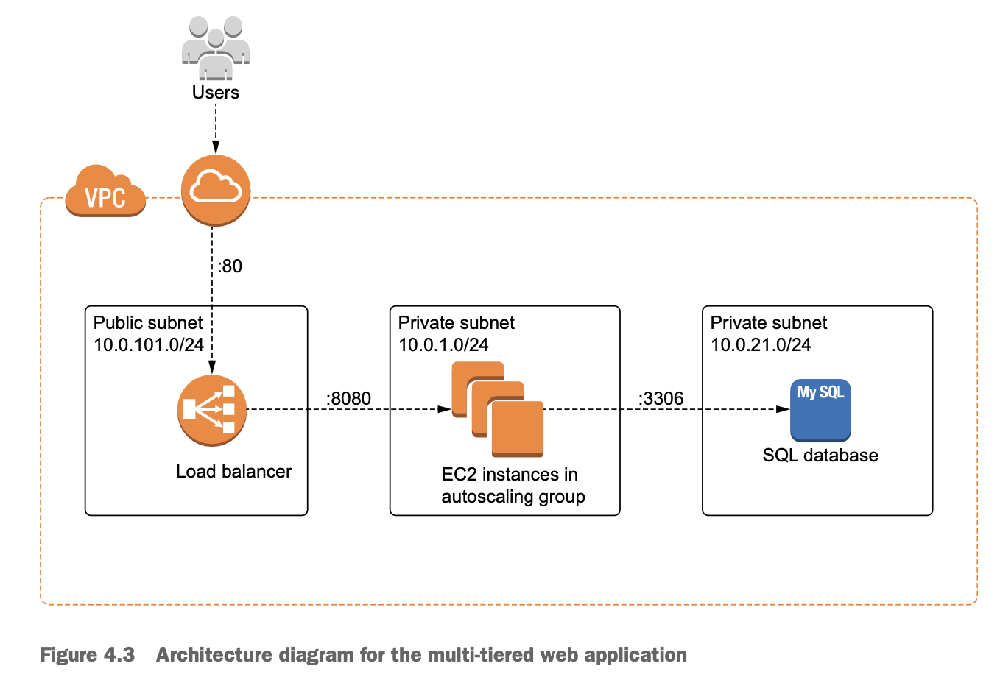
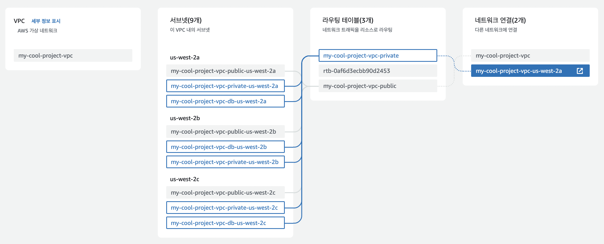
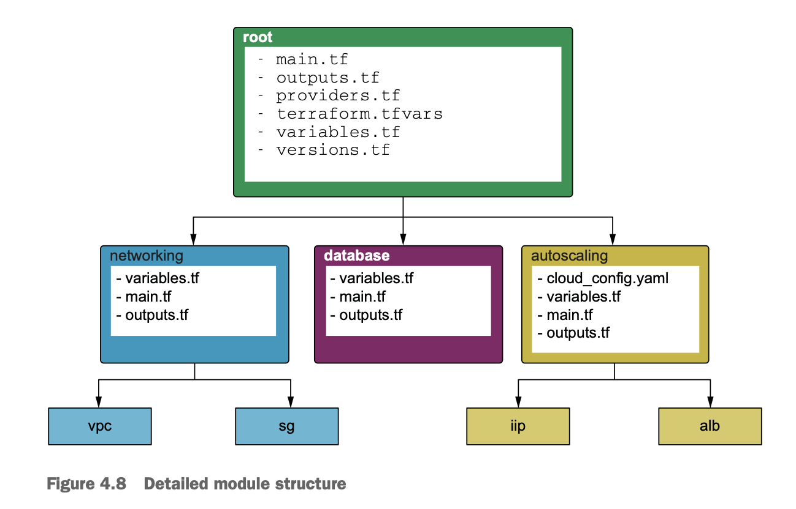
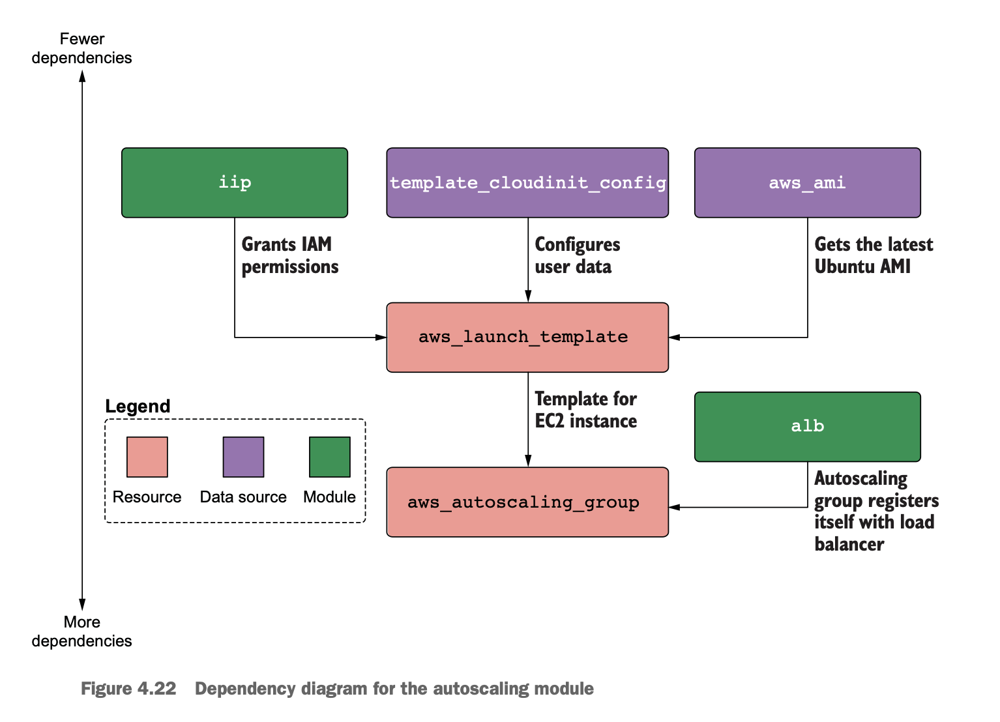

# A. architecture

다른 AZ에 있는 public subnets for load balancer

다른 AZ에 있는 private subnet for ec2 & rds

0. internet gateway
1. vpc
2. classic load balancer
	- public subnets
	- security group
3. ec2
	- private subnets connected to nat gateway
	- security group
	- ebs
4. rds
	- private subnets connected to nat gateway
	- security group

# B. project structure

