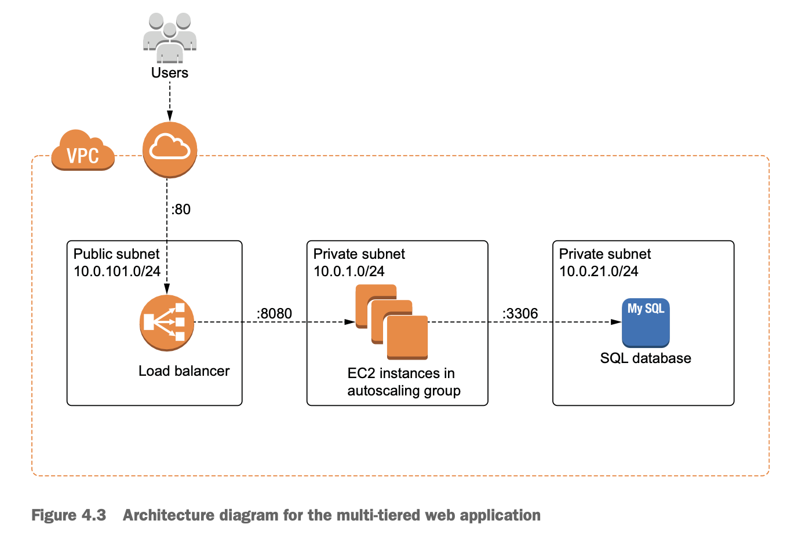
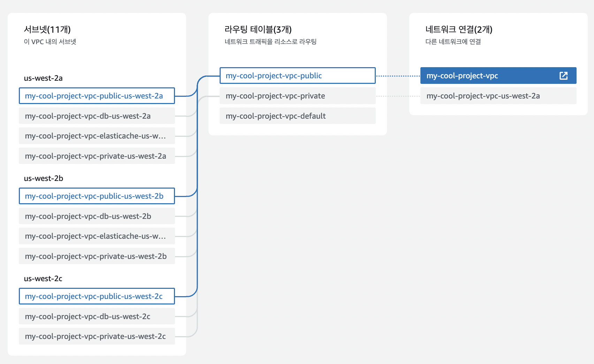
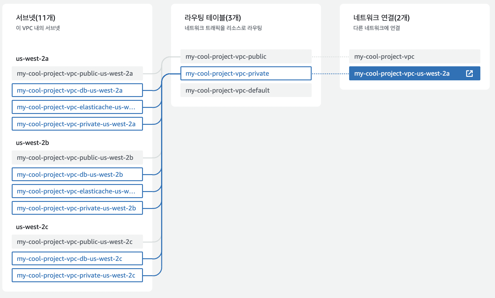
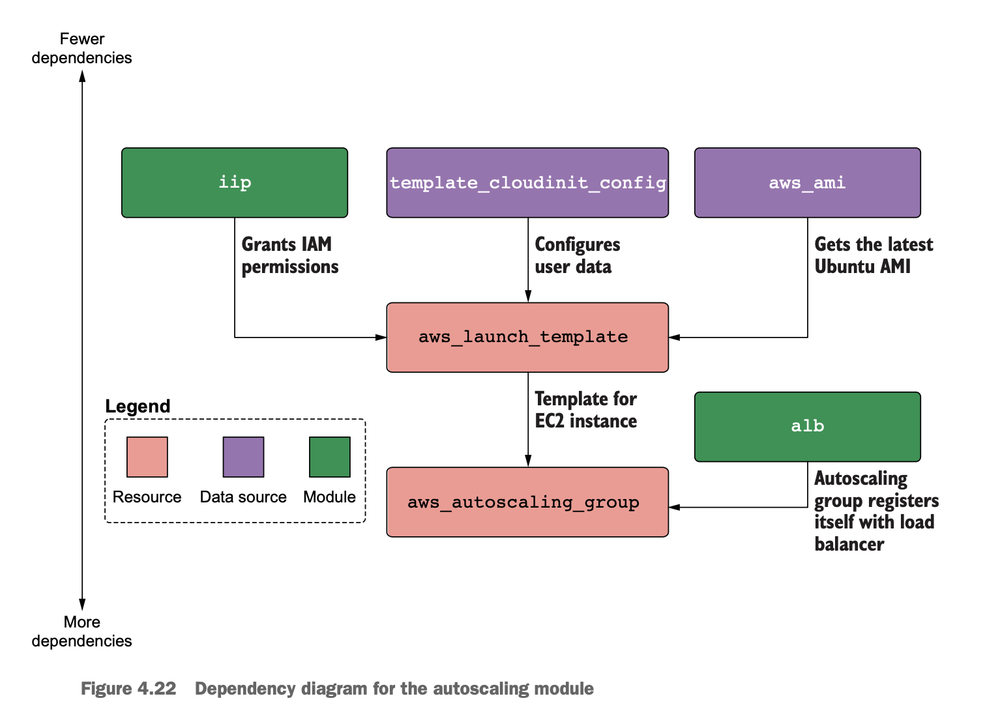

# A. architecture

\+ elasticache connected to ec2?

---

다른 AZ에 있는 public subnets for load balancer

다른 AZ에 있는 private subnet for ec2 & rds & elasticache

0. iam
	- AmazonSSMManagedInstanceCore policy for access to private ec2 using aws session manager
1. internet gateway
2. vpc
3. classic load balancer
	- public subnets
	- security group
4. ec2
	- private subnets connected to nat gateway
	- security group
	- ebs
5. rds
	- private subnets connected to nat gateway
	- security group
6. elasticache
	- private subnets
	- security group

# B. project structure

# C. resources
- elasticache terraform example - https://github.com/umotif-public/terraform-aws-elasticache-redis/blob/main/examples/redis-basic/main.tf
