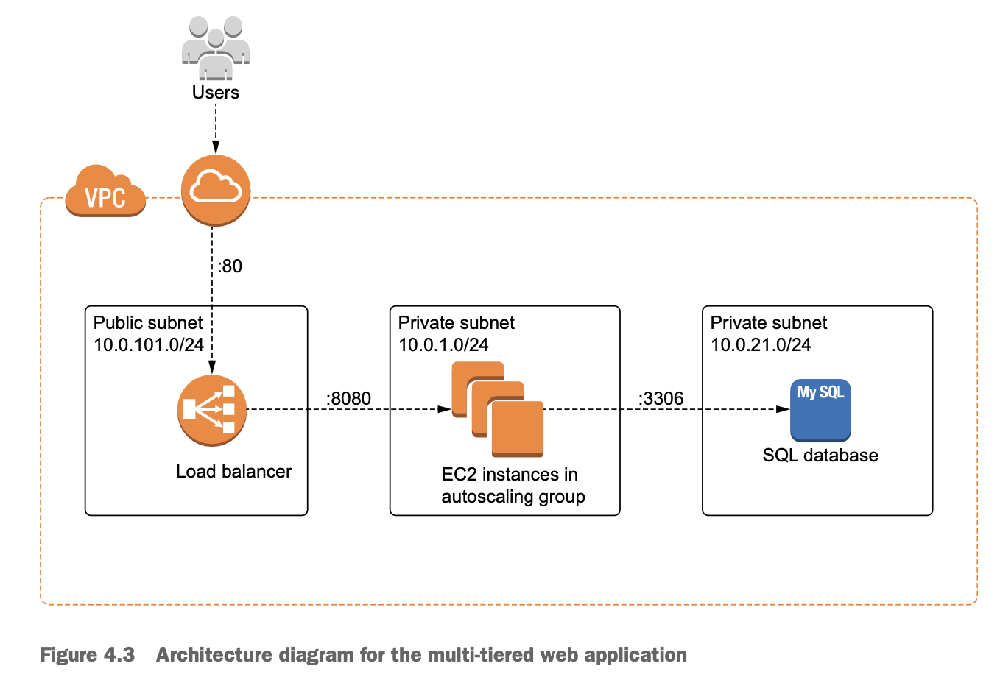
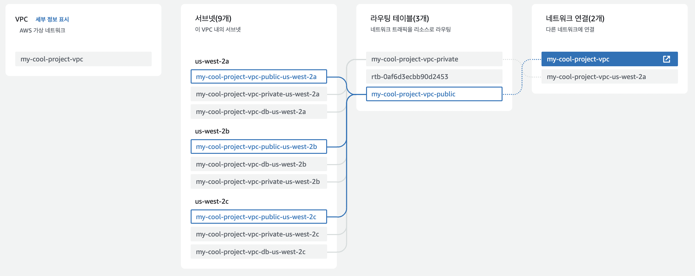
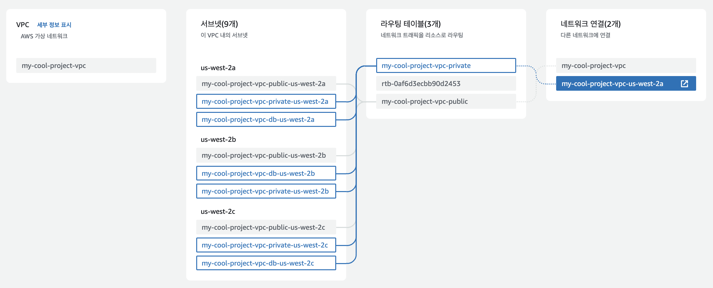

# A. architecture

다른 AZ에 있는 public subnets for load balancer

다른 AZ에 있는 private subnet for ec2 & rds

0. iam
	- AmazonSSMManagedInstanceCore policy for access to private ec2 using aws session manager
1. internet gateway
2. vpc
3. classic load balancer
	- public subnets
	- security group
4. ec2
	- private subnets connected to nat gateway
	- security group
	- ebs
5. rds
	- private subnets connected to nat gateway
	- security group

# B. project structure

